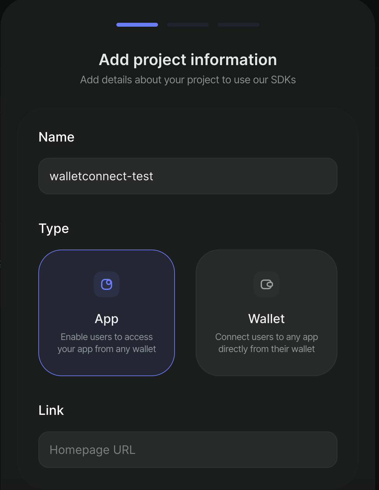

# SecretPath + WalletConnect integration

## SecretPath 🤝 WalletConnect

[SecretPath](https://docs.scrt.network/secret-network-documentation/confidential-computing-layer/ethereum-evm-developer-toolkit/basics/cross-chain-messaging/secretpath) connects Secret Network to [20+ EVM chains](https://docs.scrt.network/secret-network-documentation/confidential-computing-layer/ethereum-evm-developer-toolkit/supported-networks), enabling public EVM chains to call functions on Secret Network while preserving the privacy of the inputs and validity of the outputs.&#x20;

With [WalletConnect](https://docs.walletconnect.com/), you can create a seamless user experience with one wallet login that **allows users to interact with Secret Network smart contracts on every SecretPath-connected chain.**&#x20;


See [here](https://secretpath-ballz.vercel.app/) for a fullstack SecretPath + WalletConnect demo


In this tutorial, you will learn how to configure SecretPath and WalletConnect in React so you can create seamless UI for confidential cross-chain computation :D&#x20;

### Getting Started

1. Sign in to WalletConnect with your crypto wallet and [create a project id](https://cloud.walletconnect.com/app/27f56376-f9af-4cb1-b506-0dbed71896ba/project/a3bd111f-1e08-4c14-88cd-98acbd2b7a8a) for your project.&#x20;


When you create your project, select project type "App - Enable users to access your app from any wallet"


<figure><figcaption><p>Create a WalletConnect Project</p></figcaption></figure>

2. Select "Web3Modal" for type of project

<figure><figcaption><p>Select Web3Modal Product</p></figcaption></figure>

3. Select "React" platform to follow along with this tutorial

<figure><figcaption><p>Select WalletConnect platform</p></figcaption></figure>

4. Clone the SecretPath WalletConnect repository:&#x20;

```
git clone https://github.com/writersblockchain/secretpath-walletconnect
```

5. install the dependencies:&#x20;

```
cd frontend 
npm install 
```

5. Update the WalletConnect [project-id](https://github.com/writersblockchain/secretpath-walletconnect/blob/980989c3386738e98a703fac19341690fa2676d9/frontend/src/components/WalletConnect.js#L8) with your project-id&#x20;

Now you're ready to use WalletConnect with SecretPath!&#x20;

### Configuring WalletConnect for SecretPath

Now that you have your environment properly configured, let's understand how everything is connected. Run `npm run start` to see your WalletConnect application:

```
npm run start
```

Out of the box, you can use this React application as a starting point for your SecretPath + WalletConnect applications.&#x20;

Click "Connect Wallet" and sign in to your Metamask or EVM wallet. Click on the network you are currently connected to in order to see all of the EVM networks available:&#x20;

<figure><figcaption></figcaption></figure>

All of these 20+ networks are connected to SecretPath, which means any of these chains can call functions on Secret Network smart contracts 🤯

Now let's breakdown each of the parameters that are required to properly configure our WalletConnect [Web3Modal](https://github.com/writersblockchain/secretpath-walletconnect/blob/980989c3386738e98a703fac19341690fa2676d9/frontend/src/components/WalletConnect.js#L30).&#x20;

### Web3Modal Parameters

We must pass 5 parameters to Web3Modal: `chainImages`, `ethersConfig`, `chains`, `projectId`, and `metadata`.&#x20;

**chainImages**

[chainImages ](https://github.com/writersblockchain/secretpath-walletconnect/blob/980989c3386738e98a703fac19341690fa2676d9/frontend/src/components/WalletConnect.js#L31)is an object that associates EVM chain IDs with images that are displayed in the walletConnect UI. You can add additional chain IDs and images for each additional chain you would like included in your WalletConnect application. Currently, every chain that is supported by SecretPath is included.&#x20;

**ethersConfig**

[ethersConfig](https://github.com/writersblockchain/secretpath-walletconnect/blob/980989c3386738e98a703fac19341690fa2676d9/frontend/src/components/WalletConnect.js#L18) is an object that contains boilerplate ethers configuration code.  &#x20;

**chains**

[chains](https://github.com/writersblockchain/secretpath-walletconnect/blob/980989c3386738e98a703fac19341690fa2676d9/frontend/src/components/WalletConnect.js#L94) contains the RPC info for each chain that you connect to SecretPath. The chain info is imported from the [chains.js](https://github.com/writersblockchain/secretpath-walletconnect/blob/980989c3386738e98a703fac19341690fa2676d9/frontend/src/config/chains.js#L1) file in the config folder. If you have added RPC info for a chain to Metamask before, this should look familiar. &#x20;

**projectId**

Your unique [project id](https://github.com/writersblockchain/secretpath-walletconnect/blob/980989c3386738e98a703fac19341690fa2676d9/frontend/src/components/WalletConnect.js#L8) generated by WalletConnect.&#x20;

**metadata**

[Metadata](https://github.com/writersblockchain/secretpath-walletconnect/blob/980989c3386738e98a703fac19341690fa2676d9/frontend/src/components/WalletConnect.js#L11) unique to your dapp.&#x20;

### Putting it all together: SecretPath + WalletConnect

Now that you have your WalletConnect interface enabled to your liking, let's understand how it connects the EVM to Secret Network with SecretPath.&#x20;

Open [App.js](https://github.com/writersblockchain/secretpath-walletconnect/blob/980989c3386738e98a703fac19341690fa2676d9/frontend/src/App.js#L9). Notice that there are 3 functions working in tandem here:&#x20;

1. [`useEffect`](https://github.com/writersblockchain/secretpath-walletconnect/blob/980989c3386738e98a703fac19341690fa2676d9/frontend/src/App.js#L12), which returns the currently enabled chain ID (so every time the user switches to a new chain, this is saved in the application state)
2. [`requestRandomness`](https://github.com/writersblockchain/secretpath-walletconnect/blob/980989c3386738e98a703fac19341690fa2676d9/frontend/src/App.js#L41) - this is our SecretPath function which requests a verifiable random number from a Secret smart contract. It takes the parameter `chainId`, because the application must know which [EVM gateway contract](https://github.com/writersblockchain/secretpath-walletconnect/blob/980989c3386738e98a703fac19341690fa2676d9/frontend/src/config/contracts.js#L1) to execute based on which EVM chain is currently connected.&#x20;
3. [querySecret](https://github.com/writersblockchain/secretpath-walletconnect/blob/980989c3386738e98a703fac19341690fa2676d9/frontend/src/App.js#L43) - a query function that queries the random number stored in the Secret Network smart contract

Finally, on click, `requestRandomness` calls the  [`request_random`](https://github.com/writersblockchain/secretpath-walletconnect/blob/980989c3386738e98a703fac19341690fa2676d9/secret-rng-contract/src/contract.rs#L97) handle in the Secret smart contract, which returns a random number between 1-200. SecretPath knows which EVM gateway contract to execute based on which chain ID is currently enabled by WalletConnect (you can see the if/else logic [here](https://github.com/writersblockchain/secretpath-walletconnect/blob/980989c3386738e98a703fac19341690fa2676d9/frontend/src/functions/requestRandomness.js#L39)).&#x20;

### Summary

✨ SecretPath integrates Secret Network with over 20 EVM chains, enabling public EVM chains to execute functions on Secret Network while preserving privacy and ensuring output validity. Using WalletConnect, developers can create a seamless user experience, allowing users to interact with Secret Network smart contracts across all SecretPath-connected chains through a single wallet login. This tutorial provides a step-by-step guide to configuring SecretPath and WalletConnect in a React application, starting from signing in with WalletConnect and creating a project, to setting up the development environment. Key configurations include specifying parameters for Web3Modal, such as chainImages, ethersConfig, chains, projectId, and metadata. The tutorial also explains how to connect EVM to Secret Network using functions like `requestRandomness` and `querySecret` within the app, ensuring smooth and confidential cross-chain computations ✨


