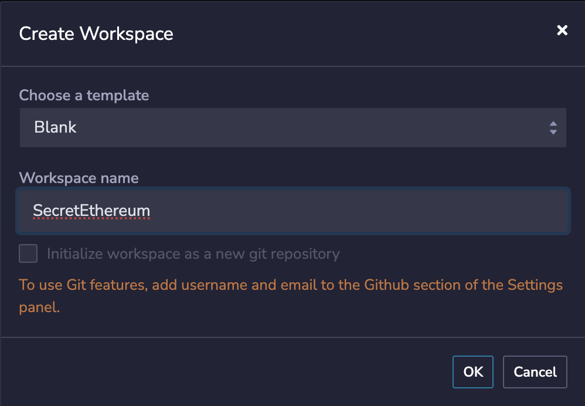
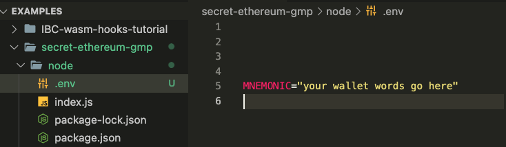

# Axelar GMP Developer Tutorial

In this tutorial, you will learn how to use Axelar GMP to send a `string` **between Polygon and Secret testnets**. To learn more about the flow architecture, [see the Axelar documentation here](https://docs.axelar.dev/dev/general-message-passing/overview#steps).&#x20;

### Prerequisites

* For GMP to work, both chain A and chain B must be EVM or Cosmos with a deployed Axelar Gateway contract. For this tutorial we will be using the [Polygon Amoy testnet Axelar Gateway contract](https://docs.axelar.dev/resources/contract-addresses/testnet). We will go into this in more detail momentarily.&#x20;
* Have [Metamask installed](https://metamask.io/download/), Polygon Amoy Network added to your wallet, and your wallet [funded with Polygon tokens](https://faucet.polygon.technology/). &#x20;


Add Polygon Amoy Network to your Metamask wallet by adding the config info [here](https://support.polygon.technology/support/solutions/articles/82000907114-how-to-add-amoy-network-in-your-wallet-). If you need tokens in bulk, fill out the request form [here](https://docs.google.com/forms/d/e/1FAIpQLSe4npoGldJknEs9EBtPaV3AS-0HTso2IuMWDCiMmLEMCx8euQ/viewform?fbzx=-2461493958490590761)


### Upload a contract to Polygon

In order to execute a smart contract on Secret network, you must first upload and instantiate a smart contract on Polygon that can execute messages using Axelar GMP. Axelar has a [github repository of example contracts ](https://github.com/axelarnetwork/evm-cosmos-gmp-sample/tree/main/cosmwasm-integration)that can be used for GMP. We will be uploading the [SendReceive.sol](https://github.com/axelarnetwork/evm-cosmos-gmp-sample/blob/main/cosmwasm-integration/send-receive/evm/contracts/SendReceive.sol) contract to Polygon for this demo.&#x20;


The Cosmwasm smart contracts in this Axelar repository are not compatible with Secret Network out of the box due to dependency issues. However, we will modify the SendReceive contract to be compatible with Secret Network.&#x20;


To upload the contract, we will use [Remix Online IDE](https://remix.ethereum.org), which is a powerful toolset for developing, deploying, debugging, and testing Ethereum and EVM-compatible smart contracts.

First, navigate to Remix and create a new blank workspace:

<figure><figcaption><p>Remix workspace</p></figcaption></figure>

Next, create a new file called `SendReceive.sol` and paste the [Axelar GMP solidity code](https://github.com/axelarnetwork/evm-cosmos-gmp-sample/blob/main/cosmwasm-integration/send-receive/evm/contracts/SendReceive.sol). This will autofill your workspace with the necessary dependencies for your SendReceive.sol contract 🤯

Now all that's left is to **compile and upload the contract**. Navigate to the Solidity compiler using the sidebar and click **"Compile SendReceive.sol"**. Then, navigate to "Deploy and run transactions." Toggle the Environment from "Remix VM (Shanghai)" to "Injected Provider - MetaMask" and make sure that in your MetaMask wallet **you have currently selected Amoy network**.&#x20;

The `constructor` of SendReceive.sol contains 3 variables that you must now input in order to instantiate the contract and link it to Axelar's Polygon **gateway contract** and **gas receiver contract**, as well as the Polygon Amoy **chain name**:&#x20;

<pre class="language-bash"><code class="lang-bash">GATEWAY CONTRACT: "0xe432150cce91c13a887f7D836923d5597adD8E31"
GASRECEIVER CONTRACT: "0xbE406F0189A0B4cf3A05C286473D23791Dd44Cc6"
<strong>CHAINNAME: "polygon-amoy"
</strong></code></pre>

Input these strings like so and then click "Transact":

Upon successful instantiation, the contract address will be returned in the Remix terminal, which you can then view on the [Amoy explorer](https://www.oklink.com/amoy). And the deployed contract can now be interacted with in the "Deployed Contracts" window:&#x20;

<figure><figcaption></figcaption></figure>

Congrats, you've just deployed an Axelar GMP-compatible contract to Polygon testnet that can send and receive messages to and from a Secret Network smart contract 🎉

### Upload a contract to Secret Network

Now that you've uploaded a GMP-compatible contract to Polygon, let's do the same on Secret Network so that the contracts can communicate with each other across the Cosmos!

First, clone this Secret Network examples repository:&#x20;

```bash
git clone https://github.com/scrtlabs/examples
```

Then, `cd` into the `examples/secret-ethereum-gmp` folder

```bash
cd examples/secret-ethereum-gmp
```

and compile the contract by running `make build-mainnet` in your terminal.

```bash
make build-mainnet
```


If this is your first time working with a Secret contract, visit the [Getting Started docs](https://docs.scrt.network/secret-network-documentation/development/getting-started/setting-up-your-environment) to properly configure your developer environment.


Now, open a new terminal window and `cd` into `examples/secret-ethereum-gmp/node`

```bash
cd examples/secret-ethereum-gmp/node
```

&#x20;and then run `npm install` to install the `package.json` dependencies.&#x20;

```bash
npm install
```

Create a `.env` file in `examples/secret-ethereum-gmp/node` and add your wallet mnemonic in order to upload the contract:&#x20;

<figure><figcaption><p>.env config</p></figcaption></figure>

You can then **upload and instantiate the contract** by running `node index.js`.&#x20;

```bash
node index.js
```

Upon successful instantiation, a Secret contract address is returned that you can then use to send messages to and from Polygon:

<figure><figcaption><p>Secret contract address upon successful instantation </p></figcaption></figure>

Now let's send a `string` from Polygon to Secret! 🚀

### Send a string from Polygon to Secret

Now that you have a GMP-compatible contract instantiated on Secret Network, you have all of the variables needed in order to send a cross-chain message using the `SendReceive.sol` contract.&#x20;

In order to send messages using Axelar GMP, **the user prepays the relayer gas fee on the source chain to Axelar’s Gas Services contract**.&#x20;


You can do this in Remix by navigating to the "Deploy and run transactions" tab in the sidebar and adding gas to prepay the gas fee.&#x20;


To make sure you have enough gas, add .40 Matic, (roughly .20 USD or 400000000000000000 [Wei](https://polygonscan.com/unitconverter)), to the transaction:

<figure><figcaption><p>Axelar Gas fee</p></figcaption></figure>

Now all that's left is to execute the transaction! From the "Deployed contracts" section of Remix, open the dropdown for the `send` function, which should have three inputs: `destinationChain`, `destinationAddress`, and `message`.  Input the following:

```bash
destinationChain: "secret"
destinationAddress: "Your Secret Contract Address"
destinationMessage: "Your message that you want to send!"
```

Once you have inputed these strings and your contract address, select "transact." Congratulations! You've just sent a `string` from Polygon to Secret Network! 🎉&#x20;


* Use the [Amoy explorer](https://www.oklink.com/amoy) to track the transaction on Polygon. Transaction times vary depending upon Poygon network congestion; you might want to "speed up" the transaction in Metamask.&#x20;
* [Use Axelarscan to track the transaction on Axelar](https://testnet.axelarscan.io/gmp/search). Here is a [successful transaction for reference](https://testnet.axelarscan.io/gmp/0x4b0f964404b176752110f86f42d09ceff98dcaf3b586759b71c2cfb0fc59e8f5:7).&#x20;


### Query the string on Secret

Now that you've successfully executed a cross-chain message from Polygon to Secret using Axelar GMP, let's query the message on Secret Network to see if the message was actually received by the Secret contract.&#x20;

**First, confirm that the transaction has been** [**successfully relayed by Axelar**](https://testnet.axelarscan.io/gmp/0x4b0f964404b176752110f86f42d09ceff98dcaf3b586759b71c2cfb0fc59e8f5:7).&#x20;


The Axelarscan status diagram indicates the following 5 steps were executed successfully:


<figure><figcaption><p>Axelarscan Transaction Status</p></figcaption></figure>

Once the transaction has been executed successfully, you can use [Secret.js](https://github.com/scrtlabs/examples/blob/41ecb28c9efcfb8f4f04c1cec87dbf73856fad7b/secret-ethereum-gmp/node/query.js#L19) to query the message:

```javascript
let get_stored_message = async () => {
  let query = await secretjs.query.compute.queryContract({
    contract_address: contractAddress,
    query: {
      get_stored_message: {},
    },
    code_hash: contractCodeHash,
  });

  console.log(query);
};

get_stored_message();
```

To execute this query, navigate to the `query.js` file in  `examples/secret-ethereum-gmp/node` and replace the `contractAdress` and `contractCodeHash` with your contract address and code hash, respectively.&#x20;

Then run `node query`.&#x20;

```bash
node query
```

If the message was executed successfully, the query will return the **Ethereum wallet address** that sent the transaction as well as the **message** that the wallet included:

```javascript
{
sender: `0x49e01eb08bBF0696Ed0df8cD894906f7Da635929`,
message: `one small step for Secret!`
}
```

Great work! Now let's send a string from Secret to Polygon!

### Send a string from Secret to Polygon&#x20;

To execute the [SendMessageEvm](https://github.com/scrtlabs/examples/blob/176a433ba2a349353e1e60652fad6ba92cfdf5f7/secret-ethereum-gmp/src/msg.rs#L11) transaction, navigate to the [`execute.js`](https://github.com/scrtlabs/examples/blob/master/secret-ethereum-gmp/node/execute.js) file in  `examples/secret-ethereum-gmp/node` and replace the `contractAdress` and `contractCodeHash` with your contract address and code hash.

Then, update `destinationAddress` to your Polygon contract address, and `myMessage` to the message that you want to send:

<figure><figcaption><p>execute.js variables</p></figcaption></figure>

#### Gas Token

Next, in order to send a GMP message from Secret to Polygon, you need to acquire some AXL tokens and include the correct IBC denom representing those tokens to your transaction to pay for gas, so that the message can be executed over IBC


Learn more about IBC denoms [here](https://tutorials.cosmos.network/tutorials/6-ibc-dev/).


The [correct IBC denom](https://github.com/scrtlabs/examples/blob/3470d6d3375ea25888371e931aea7661c511048c/secret-ethereum-gmp/node/execute.js#L40C14-L40C14) is already included in the secret.js transaction, but in order for it to execute successfully, **you need to have this IBC denom funded in your wallet**. To add this token to your wallet, you can send Axelar tokens to your Secret wallet address over IBC.


If this is your first time sending Axelar testnet tokens over IBC, see an Axelar Gas Token video tutorial [here](https://www.youtube.com/watch?v=Q3fIvXpdLyo\&ab\_channel=SeanRad), which guides you through the following steps:&#x20;


1. Add Axelar testnet to your Keplr wallet by visiting [Axelar Satellite](https://testnet.satellite.money/?source=axelar\&destination=secret\&asset\_denom=uaxl\&destination\_address=) (upon visiting the website, a Keplr notification will pop up that says, _"https://testnet.satellite.money would like to add blockchain axelar-testnet-lisbon-3 to Keplr"_)
2. Procure AXL testnet tokens from the [Axelar faucet](https://faucet.testnet.axelar.dev/).
3. Send AXL testnet tokens to your Secret testnet wallet address over IBC using [Axelar Satellite](https://testnet.satellite.money/?source=axelar\&destination=secret\&asset\_denom=uaxl\&destination\_address=).

<figure><figcaption></figcaption></figure>

Upon successful transfer, you should now see the new AXL IBC token in your Keplr Wallet:

<figure><figcaption><p>AXL IBC token</p></figcaption></figure>

Once you have properly configured your `execute.js` file and procured the IBC denom needed to execute the transaction, all that's left is to run `node execute.`&#x20;

```bash
node execute 
```

The transaction should return a `transactionHash` as well as data about the IBC routing: &#x20;

<figure><figcaption><p>send_message_evm() transaction</p></figcaption></figure>

Now, navigate to [Axelarscan to monitor the status of the transaction](https://testnet.axelarscan.io/gmp/FB15AFCBA36E8E6A1323A728527B151587E31B0667830B374D410A33837429FD).&#x20;

And for good measure, view the transaction on the [Amoy Explorer](https://www.oklink.com/amoy) to see that the message was received!

Congratulations! You now have all of the tools to send a message from Secret Network to Polygon using Axelar GMP! 🎉

### Summary

In conclusion, Axelar's General Message Passing (GMP) offers a powerful solution for achieving secure interchain communication and token transfers across diverse blockchain ecosystems, including Cosmos and Ethereum. With GMP, developers can seamlessly execute smart contracts on one blockchain from another, fostering complete composability within the Web3 landscape. This documentation has guided you through the process of deploying GMP-compatible contracts on both Polygon and Secret Network, illustrating how to send messages across these networks. By following these steps, you have unlocked the potential for seamless interoperability and enhanced functionality in your blockchain applications. Axelar GMP paves the way for a more interconnected and efficient blockchain ecosystem. Congratulations on your successful journey with Axelar GMP!

If you run into any errors or questions, ping the [#dev-issues channel](https://discord.gg/secret-network-360051864110235648) on Secret Network's Discord and somebody will get back to you shortly 😊
