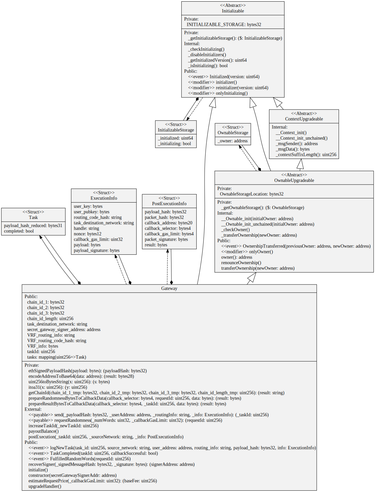

# Public EVM Gateway Architecture

The public EVM gateway sits at the heart of SecretPath. It coordinates the tasks (stored in the Task stuct and saved in a `mapping(uint256 => Task) public tasks`). It verifies the inputs when sending in encrypted Payloads in `send` and verifies the incoming callback packet in `postExecution`. A UML diagram of the upgradeable Gateway contract, together with it's dependencies, is shown below.

<figure><figcaption></figcaption></figure>
