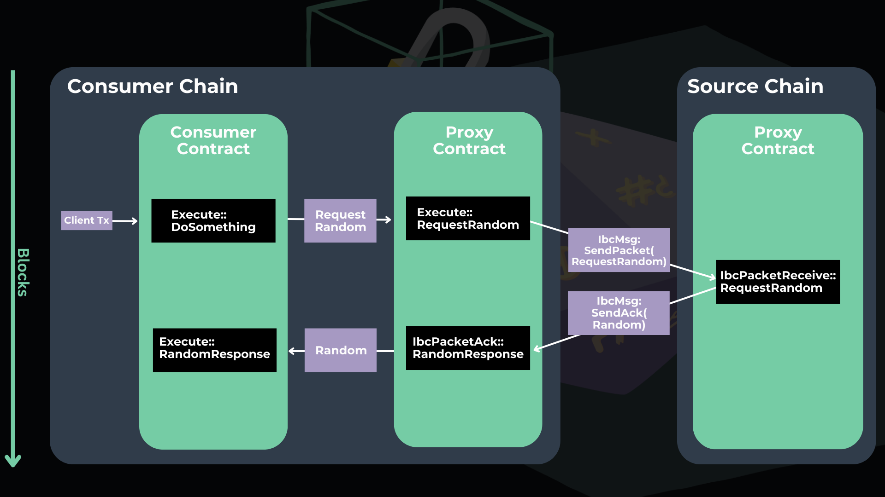

# Cross-Chain (IBC) randomness

## Cross-chain random numbers demo

This documentation serves as a demo on how to send **cross-chain random numbers from Secret Network testnet to Juno testnet via IBC**. The demo repository [can be cloned here](https://github.com/scrtlabs/examples/tree/master/secret-ibc-rng-template).&#x20;

The design system we’ll be using consists of **one Secret contract and two Juno contracts**:

* **Secret Proxy Contract**: A Secret contract that requests a random number and specifies the callback information for the response.
* **Juno Proxy Contract**: A Juno contract that sends an IBC message to fetch the random number from the Secret Network proxy contract.&#x20;
* **Juno Consumer Contract**: A Juno contract that consumes the random numbers generated by the Secret proxy contract.


The Secret proxy contract will produce a _different, non-predictable_ number for each request it receives. You can read more about random numbers on Secret Network in the [technical specification of this feature.](../../secret-contract-fundamentals/available-native-features-modules/secret-vrf-on-chain-randomness.md)


See here for a diagram of the system architecture:&#x20;

<figure><figcaption><p>Secret VRF IBC smart contract architecture</p></figcaption></figure>

### Environment Configuration

There are two steps to configuring your environment:&#x20;

1. Upload and instantiate the three smart contracts&#x20;
2. Configure an IBC relayer to properly relay packets between your chains of choice (for this demo we will use [Hermes](https://hermes.informal.systems/index.html)).&#x20;

#### Upload and instantiate Secret Smart Contract

To begin, let's upload and instantiate the Secret Network proxy smart contract with Secret.js. [Clone the repository](https://github.com/scrtlabs/examples/tree/master/secret-ibc-rng-template), then `cd` into `node`. Run `npm i` to install the dependencies. Then, update the file [`index_secret.js`](https://github.com/scrtlabs/examples/blob/14092494ba9ff6697b50eb293d6c9633335acc41/secret-ibc-rng-template/node/index\_secret.js#L7) to include your wallet mnemonic like so:&#x20;

```javascript
const wallet = new Wallet("your wallet words go here");
```

Next, upload and instantiate the smart contract. If you need guidance doing so, [refer to the docs here.  ](https://docs.scrt.network/secret-network-documentation/development/getting-started/interacting-with-the-testnet#uploading-with-secret.js)Or, simply use the Secret smart contract that has already been instantiated here:

```
secret1rmccmgwf6zf2kawrv7h5faq3tx883epz7ty6tj
```

#### Upload and instantiate Juno Smart Contracts&#x20;

Now that we have our Secret proxy contract, let's upload and instantiate the two Juno smart contracts.&#x20;


You can configure the consumer contracts for any IBC-compatible chain of your choosing. However, for this demo will be uploading and instantiating our contracts on Juno.&#x20;


First, download the wasm files for the two Juno contracts:

* [Juno Consumer Contract wasm file](https://github.com/scrtlabs/examples/blob/master/secret-ibc-rng-template/consumer/target/wasm32-unknown-unknown/release/consumer.wasm)
* [Juno Proxy Contract wasm file  ](https://github.com/scrtlabs/examples/blob/master/secret-ibc-rng-template/consumer-side-proxy/target/wasm32-unknown-unknown/release/secret\_ibc\_rng\_template.wasm)

Next, upload them to Juno testnet using either [CosmJs](https://github.com/scrtlabs/examples/blob/master/secret-ibc-rng-template/node/index\_juno.js) or the [Juno CLI](https://docs.junonetwork.io/validators/getting-setup).


&#x20;If using the CLI, update to[ junod v16.0.0](https://docs.junonetwork.io/validators/getting-setup). If using js/ts, update [CosmJS to 0.31](https://github.com/scrtlabs/examples/blob/cfd1976e30cbe78a866386e27600526a5952add9/secret-ibc-rng-template/node/package.json#L14C37-L14C37).&#x20;



To upload the contracts to Juno testnet, you need Juno testnet tokens in your wallet. Visit faucet.reece.sh/uni-6/\<your Juno address> to get a payment


Upon successful upload, you will see a success message, along with a transaction hash and code ID. Note the code ID for both contracts, as you will need this to instantiate the smart contracts on Juno.&#x20;

Next, instantiate the Juno proxy contract by running the following:&#x20;


```
junod tx wasm instantiate <codeId> '{"init": {}' --label 'juno-proxy' --no-admin --from <your juno wallet> --gas 200000 -y --chain-id uni-6 --node https://uni-rpc.reece.sh:443 --gas-prices 0.025ujunox
```



To add a wallet to junod, run the following your terminal:

&#x20;**`junod keys add <your wallet name>`**


Then, to query that the instantiation was successful and find the contract address, query the returned `txHash` with:

```
junod q tx <txHash> --node https://uni-rpc.reece.sh:443
```

You should see the `contract_address` variable. Mine is `juno1ecl4r6dhhlluz56jqm24t6ss7s9gr6d0pu2lumvpwnnk56gnw7gqpz8m6c` 🙌

Now, simply repeat the process for the Juno Consumer contract. The only difference is that the instantiation message is slightly modified because it needs to include the other Juno contract address that we just instantiated as a pointer:&#x20;


```markup
junod tx wasm instantiate <your code id> '{"init": {"rand_provider": { "address": <your juno contract address>, "code_hash": ""}}}' --label 'juno-consumer' --no-admin --from <your wallet name> --gas 300000 -y --chain-id uni-6 --node https://uni-rpc.reece.sh:443  --gas-prices 0.025ujunox
```


My contract address is `juno1z4n39vfckeuv6udx6f4e6h8d5mt3xucuwdjs6lk2ets60ejruseqnpt00k`  🙌

#### Configuring Hermes Relayer

Now that you have successfully uploaded and instantiated the three smart contracts, let's configure Hermes Relayer to relay packets between Secret test and Juno testnet.&#x20;

First, [install Hermes and Gaiad manager](https://hermes.informal.systems/quick-start/index.html).&#x20;

Then, configure Hermes by navigating to the folder `.hermes` and opening the `config.toml` file.&#x20;


If you're on a Mac, you may need to press `Command + Shift + Period` to see hidden files, such as the `.hermes` folder.&#x20;


To relay packets between Secret Network testnet and Juno testnet, update the `config.toml` file with the [configuration seen here](https://github.com/scrtlabs/examples/blob/master/secret-ibc-rng-template/config.toml).&#x20;

Next, configure Gaiad Manager by navigating to the folder `.gm`, and then update the gm.toml file with the [configuration seen here.](https://github.com/scrtlabs/examples/blob/master/secret-ibc-rng-template/gm.toml)&#x20;


If you are using Hermes Relayer, make sure your paths are set up correctly in both the `config.toml and gm.toml`. See the image below for reference:


<figure><figcaption><p>gm.toml configuration paths</p></figcaption></figure>

Now let's relay packets! 🎉&#x20;

### Consuming the random number via IBC

Now it's time to execute our IBC smart contracts and relay packets between Juno testnet and Secret testnet. If you run into any issues at this step, refer to the [hermes docs ](https://hermes.informal.systems/tutorials/local-chains/start-local-chains.html)for guidance, and also ask questions in the [Secret Network developer discord chat](https://discord.com/channels/360051864110235648/603225118545674241)!&#x20;

1. &#x20;Start Gaiad Manager

```
gm start
```

2. Create clients&#x20;

```
hermes create client --host-chain pulsar-2 --reference-chain uni-6
hermes create client --host-chain uni-6 --reference-chain pulsar-2
```

3. Create connections


```
hermes create connection --a-chain uni-6 --a-client 07-tendermint-468 --b-client 07-tendermint-235
```



In place of `07-tendermint-235 and 07-tendermint-468`,  use the client IDs returned to you in your terminal.&#x20;


Upon success, you should see a message like so:&#x20;

<figure><figcaption></figcaption></figure>

Now that a channel is established, let's create a channel identifier, which links the Juno proxy contract to the Secret proxy contract. Note that the ports listed below are the addresses of the Juno and Secret proxy contracts which we instantiated earlier.&#x20;

4. Create channel identifier&#x20;


```
hermes create channel --a-chain uni-6 --a-connection connection-612 --a-port wasm.juno1ecl4r6dhhlluz56jqm24t6ss7s9gr6d0pu2lumvpwnnk56gnw7gqpz8m6c --b-port wasm.secret1rmccmgwf6zf2kawrv7h5faq3tx883epz7ty6tj
```


After successfully creating a channel identifier, we can relay packets! Let's start Hermes and then execute the Juno consumer contract to send a random network from Secret Network to Juno 🤯

5. Start Hermes (open a new terminal window and then run the following)

```
hermes start 
```


Hermes will scan the chain for all clients, connections and channels. This might take some time, which is normal. If you want to specify which channels it scans, update the hermes config file to include the following at the [end of the chain configuration](https://github.com/scrtlabs/examples/blob/24f516d2d92ae292aab85d2007e5704f844d8b5c/secret-ibc-rng-template/config.toml#L82) (but with your channel info):&#x20;


```
[chains.packet_filter]
policy = 'allow'
list = [
  ['transfer', 'channel-495'],
]
```

After Hermes has started running, execute the Juno consumer contract to return a random number from Secret via IBC:&#x20;


```
junod tx wasm execute --from <your wallet name> juno1z4n39vfckeuv6udx6f4e6h8d5mt3xucuwdjs6lk2ets60ejruseqnpt00k '{"do_something": {}}' --gas 300000 -y --chain-id uni-6 --node https://uni-rpc.reece.sh:443 --gas-prices 0.025ujunox
```


Then, query the smart contract to see if it returned the random number:&#x20;


```
junod query wasm contract-state smart juno1z4n39vfckeuv6udx6f4e6h8d5mt3xucuwdjs6lk2ets60ejruseqnpt00k '{"last_random": {}}' --chain-id uni-6 --node https://uni-rpc.reece.sh:443 
```


Upon successful execution, a random number will be returned:

<figure><figcaption></figcaption></figure>

### Conclusion

Congrats! You now have the tools to implement cross-chain random number generation via IBC. By following these steps, you can facilitate and execute smart contracts and relay packets between Juno and Secret, as well as any other IBC-compatible chain, expanding the possibilities for blockchain interoperability and fostering new avenues for decentralized application development.

### Epilogue: IBC Fundamentals

If you are brand new to IBC, here is a quick crash course!&#x20;

To connect two CosmWasm contracts over IBC you must establish an IBC channel between them. The IBC channel establishment process uses a four way handshake. Here is a summary of the steps:

1. `OpenInit` Hello chain B, here is information that you can use to verify I am chain A. Do you have information I can use?
2. `OpenTry` Hello chain A, I have verified that you are who you say you are. Here is my verification information.
3. `OpenAck` Hello chain B. Thank you for that information I have verified you are who you say you are. I am now ready to talk.
4. `OpenConfirm` Hello chain A. I am also now ready to talk.

Once the handshake has been completed a channel will be established that the ibc messages may be sent over. In order to do a handshake and receive IBC messages your contract must implement the following entry points (which are implemented in our proxy contract):

1. `ibc_channel_open` - Handles the `OpenInit` and `OpenTry` handshake steps.
2. `ibc_channel_connect` - Handles the `OpenAck` and `OpenConfirm` handshake steps.
3. `ibc_channel_close` - Handles the closing of an IBC channel by the counterparty.
4. `ibc_packet_receive` - Handles receiving IBC packets from the counter-party.
5. `ibc_packet_ack` - Handles ACK messages from the counter-party.&#x20;
6. `ibc_packet_timeout` - Handles packet timeouts.


[Here is a great repo](https://github.com/0xekez/cw-ibc-example) to learn more about IBC fundamentals [🎉](https://emojipedia.org/party-popper/)

