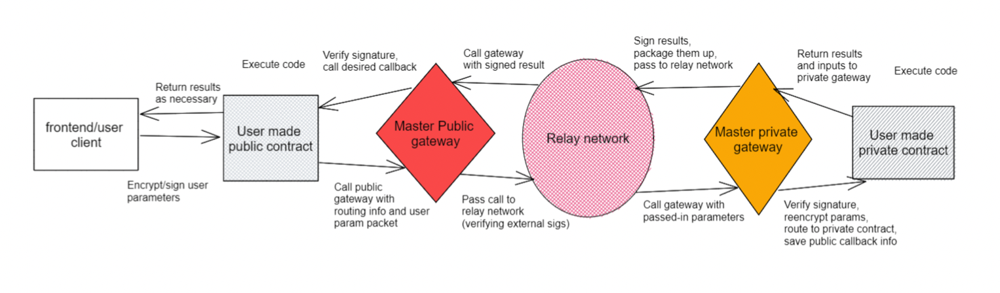

# 🏗 Architecture Overview

<figure><figcaption>
Architectual overview of Snakepath (TNLS). Taken from <a href="https://fortress-labs.gitbook.io/snakepath/high-level-architecture">https://fortress-labs.gitbook.io/snakepath/high-level-architecture</a>.
</figcaption></figure>

Snakepath consists of two core primitives: **relayers** and **gateways**.

Gateways are the onchain smart contracts that handle the broadcasting, receipt, packaging, and verification of messages. Gateways are also the mechanism by which application developers will interface with the Snakepath protocol.

These gateways are relatively simple and generic, primarily consisting of two capabilities. First, gateways can handle signature operations. For gateways on public blockchains, that means verification; for those on privacy-preserving blockchains, that means verification as well as signing. Second, gateways handle serdes operations: converting contract inputs into correctly formatted packets and vice versa.

Relayers watch for messages on one chain and then call another chain with that message. For Snakepath, the primary security-related concern is liveness, not resistance to node collusion or censorship. The relayer is not tasked with relaying funds/tokens from one chain to another, but rather with watching for encrypted messages that need to be passed. The relayer does not have access to encryption keys that can decrypt these messages or signing keys to generate new valid ones, meaning that the relayer cannot compromise the data in security or correctness.&#x20;

The most a relayer can do is to not transmit the data as requested, which would cause liveness problems for the network, but would not compromise user funds, smart contract applications, or sensitive data. This also makes the requirements for running a relayer significantly lower: a relayer needs only to be able to watch for transactions on host chains and create transactions on destination chains based on those host chain transactions.

Gateways are the onchain smart contracts that handle the broadcasting, receipt, packaging, and verification of messages. Gateways are also the mechanism by which application developers will interface with the Snakepath protocol.

These gateways are relatively simple and generic, primarily consisting of three capabilities. First, gateways can handle signature operations. For gateways on public blockchains, that means verification; for those on privacy-preserving blockchains, that means verification as well as signing. Second, gateways handle serdes operations: converting contract inputs into correctly formatted packets and vice versa. Third, gateways on privacy-preserving chains can re-encrypt their inputs under the key of the final compute contract.

For more background on how the high-level architecture of Snakepath differs from that of other interoperability networks, see section 4 of the Snakepath [whitepaper](https://uploads-ssl.webflow.com/632b43ea48475213272bcef4/632dd73d6dfc1b0cba06bbd6\_Snakepath\_whitepaper.pdf).
