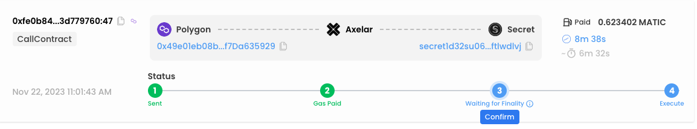

# EVM Encryption/Decryption with Secret Contracts

## EVM Encryption on Secret Network

In this tutorial you will learn **how to pass encrypted messages from EVM blockchains to Secret Network**. This is a key building block for any application that requires passing confidential data for further processing, e.g. confidential voting, private auctions, confidential order books and much more. By the end of this tutorial you will learn how to use Secret contracts to send and receive private data to and from EVM contracts. Let's dive in! 🏊

### Encryption Scheme Overview

_The following encryption scheme is used to make sure the information passed from the end user to the Secret contract and back is always encrypted in transit and cannot be read by anyone._

<figure><figcaption><p>EVM encryption scheme</p></figcaption></figure>

1. An ECDH public/private key pair is generated in a Secret smart contract.&#x20;
2. An additional ECDH public/private key pair is generated in our front end on the user's side
3. Generate a shared secret in our front end using the Secret Network contract public key and the front end's private key.&#x20;
4. Use AES + the shared secret to encrypt a message M to generate ciphertext C.&#x20;
5. Send ciphertext C from Polygon smart contract to Secret smart contract using Axelar GMP.&#x20;
6. Secret contract generates a shared secret from the front end's public key and Secret Network's contract private key
7. Decrypt ciphertext C in the Secret contract using the shared secret + AES.&#x20;

### EVM Prerequisites &#x20;

Clone the Secret Labs examples repo:&#x20;

```bash
git clone https://github.com/scrtlabs/examples.git
```

`cd` into ./examples/EVM-encrypt-decrypt/polygon:

```bash
cd EVM-encrypt-decrypt/polygon
```

Install the node dependencies:&#x20;

```bash
npm install 
```

Create a `dotenv` [file](https://github.com/scrtlabs/examples/blob/master/EVM-encrypt-decrypt/polygon/.env) and add your **Metamask private key, Infura API key, and Secret Network wallet mnemonic**:

<figure><figcaption></figcaption></figure>


* These environment variables are used in the [hardhat.config.js](https://github.com/scrtlabs/examples/blob/master/EVM-encrypt-decrypt/polygon/hardhat.config.js) file in order to execute a smart contract deployed on Polygon testnet. If you need polygon testnet tokens to execute the contract, refer to the Polygon Mumbai faucet [here](https://faucet.quicknode.com/polygon/mumbai).&#x20;
* Learn how to view your Metamask private key [here](https://support.metamask.io/hc/en-us/articles/360015289632-How-to-export-an-account-s-private-key) and create an Infura API key [here](https://www.infura.io/).&#x20;
* Fund your Secret testnet wallet with the faucet [here](https://faucet.pulsar.scrttestnet.com/).&#x20;


Be sure to use an Infura API key for **Polygon Mumbai** like so:&#x20;

<figure><figcaption></figcaption></figure>

### Upload Polygon Contract

You can view the Solidity contract which we will upload to Polygon testnet [here](https://github.com/scrtlabs/examples/blob/master/EVM-encrypt-decrypt/polygon/contracts/SendReceiveEncrypt.sol). It allows a user to send encrypted data to a specified address on another Cosmos chain and it also stores encrypted data received from other chains.&#x20;

To compile the contract run `npx hardhat compile`

```bash
npx hardhat compile
```

To upload the compiled contract to Polygon testnet run:

```bash
npx hardhat run scripts/deploy.js --network polygon
```


In [line 7](https://github.com/scrtlabs/examples/blob/d01d68d4f424b278f1563823eaa989ec6169f698/EVM-encrypt-decrypt/polygon/scripts/deploy.js#L7) of the deploy script, we specify the Axelar GMP parameters for Polygon testnet. You can find additional Axelar gateway contract addresses [here](https://docs.axelar.dev/dev/reference/testnet-contract-addresses), in the event that you'd like to deploy to a different EVM network.&#x20;


Upon successful upload you should see a contract address returned in your terminal:

```bash
SendReceiveEncrypt deployed to:  0xd100A79C25bBFFb08AaFa7E8000cd10667397967
```

Now you are ready to encrypt a message on Polygon testnet and send it to Secret testnet to be decrypted! 🎉&#x20;

### Secret Network Prerequisites

Open a new terminal window and `cd` into examples/EVM-encrypt-decrypt/secret\_network

```
cd EVM-encrypt-decrypt/secret_network
```

Compile the Secret contract:&#x20;

```bash
make build-mainnet
```


If you are on a Mac and run into compilation error:

`error occurred: Command “clang”`

Make sure you have the [latest version](https://developer.apple.com/download/applications/) of Xcode installed and then update your clang path by running the following in your terminal:&#x20;

\
`cargo clean`

`AR=/opt/homebrew/opt/llvm/bin/llvm-ar CC=/opt/homebrew/opt/llvm/bin/clang cargo build --release --target wasm32-unknown-unknown`\
\
See [here](https://github.com/rust-bitcoin/rust-secp256k1/issues/283#issuecomment-1670222980) for instructions on updating your clang path.&#x20;


Open a new terminal window and `cd` into examples/EVM-encrypt-decrypt/secret\_network/node

```bash
cd EVM-encrypt-decrypt/secret_network/node
```

Install the node dependencies:&#x20;

```bash
npm install 
```

### Upload + Instantiate Secret contract

Run the upload + instantiate script:

```bash
node index.js
```

Upon successful upload + instantiation, a contract address will be returned:&#x20;

```bash
Starting deployment…
codeId:  2486
Contract hash: 86948e8c7f72343a4801bf6022aab4ca780b1ffa6cbb3423828f04562d7df3b0
Instantiating contract…
contract address:  secret1zj4fuh42k6h2rpcnalq5wuzxys8gnqxcuhts33
```

### Get Public Key from Secret Contract

Let's start by generating an ECDH public/private keypair. Open `create_keys.js` and replace the existing contract codehash + contract address at [line 15](https://github.com/scrtlabs/examples/blob/d01d68d4f424b278f1563823eaa989ec6169f698/EVM-encrypt-decrypt/secret\_network/node/create\_keys.js#L15) with your codehash and contract address. Then run:&#x20;

```bash
node create_keys.js
```

To query the newly generated ECDH keypair, open [get`_keys.js`](https://github.com/scrtlabs/examples/blob/master/EVM-encrypt-decrypt/secret\_network/node/get\_keys.js) and replace the existing contract codehash + contract address with your codehash and contract address. Then run:&#x20;

```bash
node get_keys.js
```

Your public key should be returned:&#x20;

```bash
{
  public_key: [
      2, 104,  48, 161,  13, 111, 158, 104,
    127, 247,  41,  86,  51, 182, 130, 236,
    211, 221, 131, 107, 252, 151, 228,  19,
    153, 252, 169,  84, 186, 154, 203,  40,
    138
  ]
}
```

Now let's use this public key to encrypt a message in our Polygon smart contract!

### Send Encrypted Message from Polygon to Secret

Now that you have your Ethereum environment properly configured, you can encrypt a message of your choosing and send it to your Secret Network smart contract where it will be decrypted.&#x20;

* Open [`encrypt.js`](https://github.com/scrtlabs/examples/blob/master/EVM-encrypt-decrypt/polygon/scripts/encrypt.js)  in ./EVM-encrypt-decrypt/polygon/scripts/encrypt.js.&#x20;
* Update [line 22](https://github.com/scrtlabs/examples/blob/d01d68d4f424b278f1563823eaa989ec6169f698/EVM-encrypt-decrypt/polygon/scripts/encrypt.js#L22) with your Secret Network public key. &#x20;
* Update the Polygon contract [address](https://github.com/scrtlabs/examples/blob/d01d68d4f424b278f1563823eaa989ec6169f698/EVM-encrypt-decrypt/polygon/scripts/encrypt.js#L73) and Secret contract [address](https://github.com/scrtlabs/examples/blob/d01d68d4f424b278f1563823eaa989ec6169f698/EVM-encrypt-decrypt/polygon/scripts/encrypt.js#L76) with your contract addresses.&#x20;
* Update the `msg` variable at [line 78](https://github.com/scrtlabs/examples/blob/35ce04ec46dee33ca365317be562ddbace65c88a/EVM-encrypt-decrypt/polygon/scripts/encrypt.js#L78) with a message of your choosing which will be encrypted.&#x20;

Then, execute the Polygon smart contract to encrypt the message and send it to a Secret smart contract:&#x20;

```bash
npx hardhat --network polygon run ./scripts/encrypt.js
```

If the transaction is executed successfully, a transaction hash will be returned:&#x20;


```bash
Transaction hash: 0x605cb8c5b069aea9f79d7e9ba36aec91fe33a1800849a99553ad616053587236
```



When you execute encrypt.js, it writes the public key to your .env file so that you can use it to decrypt the message in your Secret Network smart contract.


You can now find this transaction on [Polygonscan](evm-encryption-decryption-with-secret-contracts.md#get-public-key-from-secret-contract) and [Axelarscan](https://testnet.axelarscan.io/gmp/0xfe0b8477411bca9f9c21e38eb23d88e07006d530a65f114e4727e4513d779760:47) by pasting the transaction hash.&#x20;

View the transaction on Axelarscan to monitor its status:

<figure><figcaption><p>Axelarscan transaction status</p></figcaption></figure>

**Once you see the transaction has been "executed" on Axelarscan**, proceed to the next step of the documentation to learn how to decrypt the message. 😊


_Note: your message was encrypted, and the plaintext message will not appear in either Polygon or Axelar blockchains. You can validate that by looking at the `Logs` tab for your transaction in Polygonscan and finding the `ContractCall` log._


### Decrypt the message on Secret

Now let's decrypt the message. To execute the decryption, you will first need to update `secret_network/node/decrypt.js` and **set the** [**contractAddress**](https://github.com/scrtlabs/examples/blob/d01d68d4f424b278f1563823eaa989ec6169f698/EVM-encrypt-decrypt/secret\_network/node/decrypt.js#L17) **and**[ **contractCodeHash**](https://github.com/scrtlabs/examples/blob/d01d68d4f424b278f1563823eaa989ec6169f698/EVM-encrypt-decrypt/secret\_network/node/decrypt.js#L15) **to your address and codehash**.


Before you try to decrypt the encrypted message, make sure the transaction has been executed successfully on [Axelarscan](https://testnet.axelarscan.io/gmp/0x605cb8c5b069aea9f79d7e9ba36aec91fe33a1800849a99553ad616053587236:29). Transaction times have been averaging around 5 minutes.&#x20;


Then cd into `secret_network/node`&#x20;

```bash
cd secret_network/node 
```

and run `node decrypt:`

```bash
node decrypt
```

Upon successful execution, you should see a transaction message and your decrypted data returned:&#x20;

```bash
 decrypted: '{"test":"Secret 4ever!!!"}' 
```

### Secret Contracts Decryption Overview

If you would like to understand how the decryption works behind the scenes, refer to the `try_decrypt()` function in [contract.rs](https://github.com/scrtlabs/examples/blob/ce83c3f4f313820d0f7510b31f1243d70a2a3d4f/EVM-encrypt-decrypt/secret\_network/src/contract.rs#L75).&#x20;

Here is a high level overview:&#x20;

1. **Load Private Key**:
   * The function loads a private key from storage using `MY_KEYS.load(deps.storage)?`.&#x20;
2. **Validate Keys**:
   * It then validates the loaded private key and the provided front end public key, converting them from byte slices to their respective key types (`SecretKey` and `PublicKey`).
3. **Create Shared Secret**:
   * A shared secret is generated using the `SharedSecret::new` function, which combines the front end's public key and the Secret contract's private key.
4. **Decrypt Ciphertext**:
   * The function then decrypts the ciphertext we sent using the `aes_siv_decrypt` function, which uses the AES-SIV (Symmetric Initialization Vector) algorithm. It requires the ciphertext, additional authenticated data (empty in this case), and the derived shared key.
5. **Handle Decrypted Data**:
   * If decryption is successful, it converts the decrypted data to a `String` and saves the decrypted string in storage.

### Conclusion

Congrats! You have now successfully passed an encrypted message from Polygon to Secret and decrypted it on Secret using AES and ECDH key agreement, along with Axelar GMP! 🎉

This opens up a whole new standard of cross-chain use cases such as private voting, private auctions, and anything you can imagine that utilizes cross-chain encryption!&#x20;

### Glossary

**ECDH (Elliptic Curve Diffie-Hellman)**: ECDH is a key agreement protocol that allows two parties, each having an **elliptic curve public-private key pair**, to establish a **shared secret** over an insecure channel. This shared secret can then be used to encrypt subsequent communications. We use ECDH between Secret Network and Polygon to establish a shared secret that can be used to safely encrypt and decrypt the messages being sent.

1. **Key Pairs**: Each party (our front end and our Secret smart contract) generates their own ECDH key pair, which consists of a private key and a public key (a point on the elliptic curve). The private key is kept secret, while the public key can be openly shared.
2. **Public Key Exchange**: The two parties exchange their public keys. The security of ECDH ensures that even if this exchange is intercepted, the shared secret cannot be easily computed by a third party.
3. **Shared Secret:**
   * Due to the properties of elliptic curves, when you multiply your private key with someone else's public key, the result is the same point on the curve as when the other party multiplies their private key with your public key.
   * This resulting point on the elliptic curve is used to derive the shared secret, typically by taking the x-coordinate of the point and using a hash function to generate a fixed-size key.
   * This shared secret will be the same for both parties and can now be used to encrypt and decrypt messages between them. The ECDH shared secret is used as the symmetric key in an encryption algorithm like AES.

**AES (Advanced Encryption Standard)**: AES is an encryption algorithm that uses the same key for encrypting and decrypting data, which is why a shared secret is useful. We use AES to encrypt a message into cipher text (using the ECDH shared secret as the key)  before it is sent from Polygon testnet to Secret testnet.&#x20;
