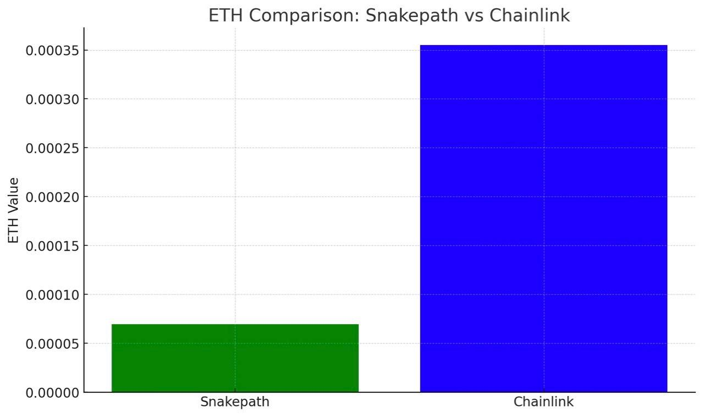

# Performance figures of SecretVRF vs competitors

SecretVRF stands out in the competitive landscape of verifiable random functions (VRFs) by offering a significant cost and speed advantage over its principal competitors. Notably, it provides approximately a 4 times cost benefit, which is a massive saving for projects that rely on random number generation at scale. This economic efficiency is largely due to its optimized gas usage, which minimizes the on-chain transaction cost.

In addition to its cost benefits, SecretVRF is also twice as fast as its closest competitor. This speed improvement is critical for applications that require almost real-time randomness, such as gaming, lotteries, and various DeFi protocols.

To demonstrate, we have this small video here outlining all of the advantages of SecretVRF vs. its biggest competitor:&#x20;


Short Video from Sean Rad (Dev Rel at the Secret Network Foundation) showing off the advantages of SecretVRF vs competitors.


### Gas Figures for SecretVRF vs Competitors

An example contract call using SecretVRF on Ethereum Sepolia which requests 20 random words is compared for its gas usage. Here, we use the example contracts provided in the documentation of Chainlink. In both cases, response time for Secret VRF is at around 1-2 blocks, so around 10s.&#x20;

#### For calling the VRF for 20 random numbers (less is better):&#x20;

**94k** Gas with Secretpath: [Etherscan Sepolia](https://sepolia.etherscan.io/tx/0x71942fa13e8b9a5d3dc5e587c82e587f5b6e2f4e61ec2bcab253c9ad71710c89)&#x20;

**300k+** Gas for Chainlink VRF with their example project: [Etherscan Sepolia](https://sepolia.etherscan.io/tx/0xdb58ed5326365aa6e611a62fe5f61cc462b504046e9e71c97d889970899e4e45)

#### For the Callback (less is better):&#x20;

**55k** gas with Secretpath: [Etherscan Sepolia](https://sepolia.etherscan.io/tx/0xe2c06a5d92b29ae5528adcd5131ed159fdf5c56c828d71e42df5003f84d6b4af\))

**200k+** gas for Chainlink VRF with their example project:[ Etherscan Sepolia](https://sepolia.etherscan.io/tx/0xe70ba65b83ce2f6b1272da9e9097cc48ea2e674457b125e859ebd45286e44f17)

In total, we also do not need to pay in special LINK tokens and instead can just pay in the native gas token of the chain (here: Sepolia ETH), which saves you additional costs.

<figure><figcaption>
Comparison of SecretVRF via SecretPath (left) vs ChainlinkVRF (right). The total cost difference between both is around 450%. 
</figcaption></figure>

To summarize, SecretVRF's combination of cost efficiency, speed, and EVM chain compatibility makes it a compelling choice for developers and projects seeking reliable and economical verifiable random functions. Its technical innovations position it as a leader in the space, offering tangible benefits that can significantly enhance the performance and cost-effectiveness of a wide range of blockchain applications.
