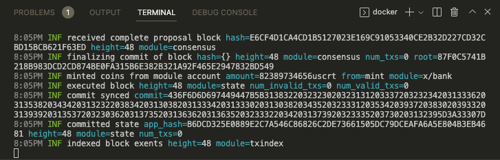

# Setting Up Your Environment

Secret Contracts are written using the [CosmWasm framework](https://book.cosmwasm.com/). CosmWasm contracts are written in Rust, which is later compiled to WebAssembly (or WASM for short). To write our first Secret Contract, we need to set up a LocalSecret development environment with all the tools required so that you can upload, instantiate, and execute your smart contracts.


For a step-by-step Secret Network environment configuration video tutorial, [follow along here](https://www.youtube.com/watch?v=m64c\_3fui3o\&ab\_channel=SecretNetwork) 🎥. Otherwise, continue reading!


## What Is LocalSecret? <a href="#what-is-localsecret" id="what-is-localsecret"></a>

LocalSecret is a complete Secret Network testnet and ecosystem containerized with Docker. It simplifies the way secret contract developers test their contracts in a sandbox before they deploy them on a public testnet or mainnet (You can think of it like a local testnet that only you have access to).

There are 3 main tools we will use -

* IDE - a development environment (usually VS Code or JetBrains CLion/IDEA with Rust support)
* SecretCLI - a command-line tool to interact with the blockchain
* LocalSecret - a local Secret Network chain set up for development purposes

We're going to install our environment manually so that you can code in a text editor of your choosing, but if you would prefer to work with JetBrains you can also configure your environment that way using the resources at the bottom of this page.

### Install Requirements

To follow along with the guide, we will be using `git,` `make,` `rust,` and `docker`.



```bash
sudo apt-get install git make
```



Install `git`:

1. Download the latest [Git for Mac installer](https://sourceforge.net/projects/git-osx-installer/files/).
2. Follow the prompts to install Git.
3. Open a terminal and verify the installation was successful by typing `git --version`

Install `make`:

```bash
brew install make
```



Install `git` and `perl` (for Windows):

1. Go to [https://git-scm.com/download/win](https://git-scm.com/download/win) and the download will start automatically. Note that this is a project called Git for Windows, which is separate from Git itself; for more information on it, go to [https://gitforwindows.org](https://gitforwindows.org/).

2. Go to [https://strawberryperl.com](https://strawberryperl.com) and download the recommended version for your system. StrawberryPerl is an open-source Perl environment for Windows; for more information, visit [https://perl.org](https://www.perl.org/get.html#win32). Perl is used to build other dependencies that will be installed later.

**Note:** support for `make` on Windows is limited, so we'll provide separate commands for Windows where necessary



#### Install Rust



```bash
curl --proto '=https' --tlsv1.2 -sSf https://sh.rustup.rs | sh
```



```bash
curl https://sh.rustup.rs -sSf | sh
```



Download and run [`rustup-init.exe`](https://static.rust-lang.org/rustup/dist/i686-pc-windows-gnu/rustup-init.exe).



Download and run [the Rust .msi installer](https://static.rust-lang.org/dist/rust-1.68.2-x86_64-pc-windows-msvc.msi)



#### Add WASM build target

```
rustup target add wasm32-unknown-unknown
```


**Having Trouble?** You might need to restart your terminal, or run a command like:

_`source "$HOME/.cargo/env"`_

After installing Rust to configure the current shell


#### Install Cargo Generate

Cargo generate is the tool you'll use to create a smart contract project. [Learn more about `cargo-generate` here.](https://doc.rust-lang.org/cargo)

```
cargo install cargo-generate --features vendored-openssl
```

#### Install Docker

[Docker](https://docs.docker.com/get-docker/) is an open platform for developing, shipping, and running applications.

#### Install SecretCLI

SecretCLI is a command-line tool that lets us interact with the Secret Network blockchain. It is used to send and query data as well as manage user keys and wallets.



```bash
wget https://github.com/scrtlabs/SecretNetwork/releases/download/v1.6.0/secretcli-Linux
chmod +x secretcli-Linux
sudo mv secretcli-Linux /usr/local/bin/secretcli
```




Run the following commands in Powershell to download the latest version of SecretCLI and add it to your profile's PATH:

```powershell
mkdir "$home\appdata\local\secretcli"
wget -O "$home/appdata/local/secretcli/secretcli.exe" https://github.com/scrtlabs/SecretNetwork/releases/latest/download/secretcli-Windows
$old_path = [Environment]::GetEnvironmentVariable('path', 'user');
$new_path = $old_path + ';' + "$home\appdata\local\secretcli"
[Environment]::SetEnvironmentVariable('path', $new_path,'User');
```

Afterwards, restart the terminal and test the installation with the following command:

```powershell
secretcli version
```




Download `secretcli` for your system [here](https://github.com/scrtlabs/SecretNetwork/releases/download/v1.6.1/secretcli-macOS).

Set the file name to `secretcli` and set it as executable

```
mv secretcli-macOS secretcli
chmod 755 secretcli
```



Download `secretcli` for your system [here](https://github.com/scrtlabs/SecretNetwork/releases/download/v1.6.1/secretcli-MacOS-arm64).

Set the file name to `secretcli` and set it as executable

```
mv secretcli-macOS secretcli
chmod 755 secretcli
```



For a more detailed and in-depth guide on SecretCLI installation and usage, check out the [documentation here](https://docs.scrt.network/secret-network-documentation/development/tools-and-libraries/secret-cli/install).

#### Install LocalSecret


An instance of LocalSecret requires approximately 2.5 GB of RAM to run. You may need to increase the resources available in your Docker settings.



The installation methods differ based on the processor architecture. This is because Secret Network makes use of Intel SGX to protect private data.


Now that you have docker installed, open the docker application and then in your terminal run:



```bash
docker run -it -p 9091:9091 -p 26657:26657 -p 1317:1317 -p 5000:5000 \
  --name localsecret ghcr.io/scrtlabs/localsecret:v1.6.0
```



Unfortunately, even LocalSecret inside a docker cannot be run on an M1 Mac. As a workaround, we recommend using a LocalSecret instance in a Gitpod environment.

This environment is set up in such a way that can be accessed remotely as well.

To get started, follow the instructions at the [main repo here](https://github.com/scrtlabs/GitpodLocalSecret).

To connect, prepend the port number with the Gitpod URL. e.g., if my workspace is at `https://scrtlabs-gitpoddevenv-shqyv12iyrv.ws-eu54.gitpod.io` then I would be able to connect to the RPC service at `https://26657-scrtlabs-gitpoddevenv-shqyv12iyrv.ws-eu54.gitpod.io`

To set up SecretCLI to connect to this environment, use the following commands

```bash
secretcli config node https://26657-<your-gitpod-workspace>.gitpod.io
secretcli config chain-id secret-testnet-1
secretcli config keyring-backend test
secretcli config output json
```



Congrats! You now have a containerized version of LocalSecret running inside docker! You should see blocks being created in real time:

<figure><figcaption><p>LocalSecret developer testnet</p></figcaption></figure>

Now it's time to learn how to compile and deploy your first smart contract 🎉

<details>

<summary>JetBrains Dev Environment (Secret IDE)</summary>

The amazing folks at [Digiline](https://www.digiline.io) created a prebuilt containerized environment containing an IDE (IntelliJ IDEA) that contains everything you need to get started. If you're comfortable with JetBrains IDEs, this may be a good choice for you.

To complement Secret IDE, we will set up another docker container with LocalSecret, where we will deploy our contracts to test and play around with.

To get started, visit [https://github.com/digiline-io/Secret-IDE-Plugin](https://github.com/digiline-io/Secret-IDE-Plugin), or just go for it and run the IDE from docker:

`docker run -p 8888:8888 -it ghcr.io/digiline-io/secret-ide:0.0.8`

Then after a few seconds you will be able to access your in-browser IDE at [https://localhost:8888](https://localhost:8888).

Once the environment loads, clone the repository from [https://github.com/scrtlabs/secret-template](https://github.com/scrtlabs/secret-template)

Secret IDE has built-in support for both the Pulsar testnet and mainnet, but for the purposes of this guide we will be using the SecretCLI via terminal.

Secret-IDE is also available as a plugin for IDEA, so you can just install it from the marketplace.

Lastly, it will be helpful to configure SecretCLI by using the included "Configure secretcli" command which will set up SecretCLI to target the public testnet

</details>

<details>

<summary>Gitpod Set Up Instructions (for M1 Mac users)</summary>

LocalSecret cannot be run on an M1 Mac.

To know whether you have a Mac with an M1 chip or an Intel chip, click on the Apple logo located in the lefthand corner of your desktop and navigate to **About This Mac/Overview,** and confirm whether the processor is M1 or Intel. If you have an Intel chip, you can run LocalSecret in docker, otherwise, proceed with these set up instructions to learn how to [run LocalSecret in Gitpod](https://github.com/scrtlabs/GitpodLocalSecret).

1. Run an instance of LocalSecret in Gitpod by [clicking here](https://gitpod.io/#https://github.com/scrtlabs/GitpodLocalSecret).
2. Gitpod will automatically create a workspace and ask if you want to open it in your text editor. It will then prompt you to allow an extension to open the URI. Select "Open" to proceed.
3. If you don't have a registered SSH public key for your computer in your Gitpod account, it will ask you to copy a temporary password to use until you restart the workspace at a later date. Copy the password.
4. Enter the password you copied in your text editor to finish setting up the SSH host connection.
5. Congrats! You have successfully set up an instance of LocalSecret in Gitpod which you can use for testing your smart contracts.

</details>

##
