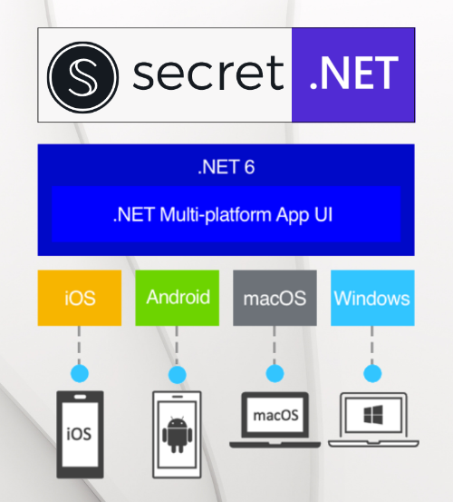

# Secret.NET 
 
**Secret.NET** (full port of the [secret.js Client](https://docs.scrt.network/secret-network-documentation/development/tools-and-libraries/secretjs)) is a .NET SDK for writing applications that interact with the Secret Network blockchain.

* Written in C# / .NET 6 including MAUI Support.
* Can be used in MAUI Apps on Android, iOS, Windows and Mac.
* Provides simple abstractions over core data structures.
* Supports every possible message and transaction type.
* Exposes every possible query type.
* Handles input/output encryption/decryption for Secret Contracts.
* The SDK has a wallet built in and does not currently require / support external wallets.
* Custom APIs / clients for specific smart contracts can be easily created and the additional packages for tokens / SNIP20 or NFT / SNIP721 (see below) can serve as an example for this.



You can find the source code and full version of the docs at [https://github.com/0xxCodemonkey/SecretNET/](https://github.com/0xxCodemonkey/SecretNET/)

## Additional packages
In addition the following complementary packages are available, which act as a layer on top of the Secret.NET:
- [**SecretNET.Token**](https://github.com/0xxCodemonkey/SecretNET.Token) supports all methods of the [reference implementation](https://github.com/scrtlabs/snip20-reference-impl) of the [**SNIP20 contract**](https://docs.scrt.network/secret-network-documentation/development/snips/snip-20-spec-private-fungible-tokens).

- [**SecretNET.NFT**](https://github.com/0xxCodemonkey/SecretNET.NFT) supports all methods of the [reference implementation](https://github.com/baedrik/snip721-reference-impl) of the [**SNIP721 contract**](https://docs.scrt.network/secret-network-documentation/development/snips/snip-721-private-non-fungible-tokens-nfts).


## Install / Add Secret.NET to a project
All packages are available via NuGet and can be easily installed
``` nuget.exe ``` -CLI:
``` bash 
nuget install SecretNET
nuget install SecretNET.Token
nuget install SecretNET.NFT
```
[NuGet-Paket-Manager-Console](https://docs.microsoft.com/de-de/nuget/consume-packages/install-use-packages-powershell):
```  bash
Install-Package SecretNET
Install-Package SecretNET.Token
Install-Package SecretNET.NFT
```

:information_source: **Secret.NET unfortunately cannot be connected to localsecret (Docker) yet**, as the docker image currently does not provide an encrypted connection on gRPC-web port 9091.
As far as I know, .NET cannot be connected to an unencrypted port via gRPC-web unless it offers HTTP/2 exclusively, which is not the case with localsecret (it also runs HTTP 1.1 on port 9091). See [here](https://learn.microsoft.com/en-us/aspnet/core/grpc/troubleshoot?view=aspnetcore-6.0#call-insecure-grpc-services-with-net-core-client) and [here](https://learn.microsoft.com/en-us/aspnet/core/grpc/aspnetcore?view=aspnetcore-6.0&tabs=visual-studio#protocol-negotiation).

## What is .NET MAUI?

**.NET Multi-platform App UI (.NET MAUI)** is a cross-platform framework for creating native mobile and desktop apps with C# and XAML.

Using .NET MAUI, you can **develop apps that can run on Android, iOS, macOS, and Windows from a single shared code-base**.

.NET MAUI is open-source and is the evolution of Xamarin.Forms, extended from mobile to desktop scenarios, with UI controls rebuilt from the ground up for performance and extensibility. 

Using .NET MAUI, you can create multi-platform apps using a single project, but **you can add platform-specific source code and resources if necessary**. One of the key aims of .NET MAUI is to enable you to implement as much of your app logic and UI layout as possible in a single code-base.

## Who .NET MAUI is for

.NET MAUI is for developers who want to:
- Write cross-platform apps in XAML and C#, from a single shared code-base in Visual Studio.
- Share UI layout and design across platforms.
- Share code, tests, and business logic across platforms.

## More informations about .NET MAUI: 
- [What is .NET MAUI?](https://learn.microsoft.com/en-us/dotnet/maui/what-is-maui)
- [Learn how to use .NET MAUI to build apps that run on mobile devices and on the desktop using C# and Visual Studio.](https://learn.microsoft.com/en-us/training/paths/build-apps-with-dotnet-maui/)
- [Resources to Get Started with .NET MAUI](https://devblogs.microsoft.com/dotnet/learn-dotnet-maui/)
