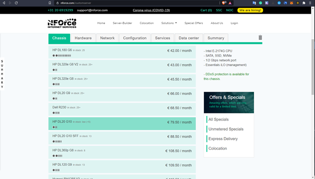
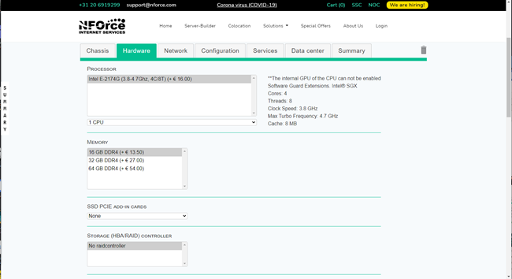

# Guide to get started with setup on Nforce.

Things to node before setting up on Nforce.
1. Only certain chasis and CPU confiuration have SGX enabled.
2. You need to manually communicate with Nforce to give you the right configuration so that SGX works on the BIOS.

## Installtion Step By Step

### 1. Getting the Right Configuration 

For the purpose of this Guide i selected the **HP DL20 G10** Chasis. For the CPU i slected the **Intel E2174G (3.8-4.7 Ghz, 4C/8T)**

With 16 GB of ram, Ubuntu OS and 512 GB SSD. Pretty basic but works.

### 2. Wait for the configuration to be deliverd to you.

This takes about 1 day, you may need to make sure they have the servers, if they do not make sure you request only the same configuration or the SGX wont be enabled.

### 3. Login into their [Portal](https://ssc.nforce.com/account)
The SSC portal is only enabled once you finish the payment. Go to your dedicated servers and select the image.
Go to remote managment and create a session to log into the BIOS (their are multiple methods i used the Java, but you can use the weeb based). Yout need to make sure Hyper Threading is disabled (It was disabled by default for my configuration by support, you can request the same).

### 4. Install SGX utilities from the [Secret Network Documentation](build.scrt.network)
