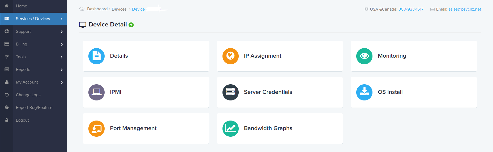

# Guide to get started with setup on Psychz.

Website: [psychz](https://www.psychz.net/dashboard/client/web/order/dedicated-server?processor=&processorBaseFreq=&numberOfCpu=7391&cpuCores=&location=)

Things to note before setting up on Psychz.
1. Only certain CPU's are available with setup
2. You need to manually Open the BIOS and select the configuration.

## Installation Step By Step

### 1. Getting the Right Configuration 

For the purpose of this Guide i selected the **E3-1270 v5** CPU. As this is the only working version I have found.

With 16 GB of ram, Ubuntu OS and 512 GB SSD. Pretty basic but works.

### 2. Wait for the configuration to be deliverd to you.

This takes about 1 day, you may need to make sure they have the servers, if they do not make sure you request only the same configuration or the SGX wont be enabled. 

Make sure you request them to install the **Latest BIOS** for the SGX to work

### 3. Login into their [Portal](https://www.psychz.net/dashboard/)
The Dashboard portal is only enabled once you signup. Go to your device section. 
Go to IPMI(remote managment) and create a session to log into the BIOS, I used the Java to download and connect to the BIOS over the port. Yout need to make sure Hyper Threading is disabled in the BIOS so that you can get an ok Platform.

### 4. Install SGX utilities from the [Secret Network Documentation](build.scrt.network)
Login with your credentials and proceed with SGX installation.