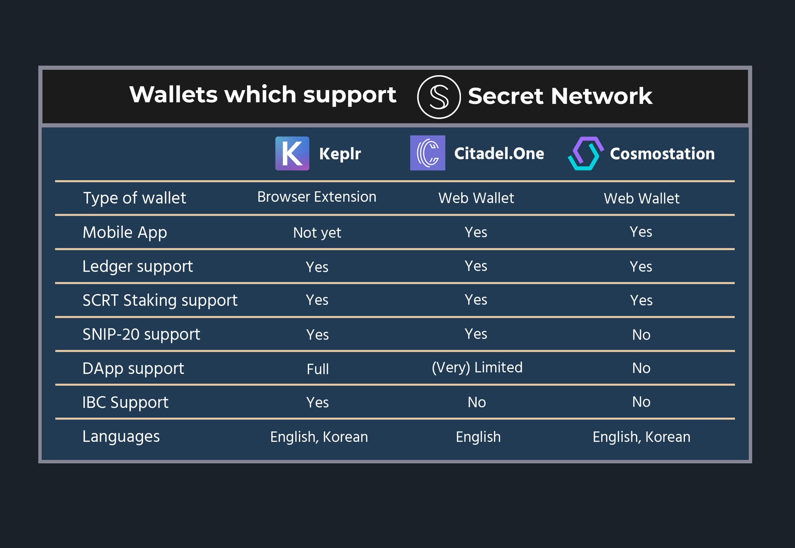

# Ecosystem Overview

This is a list of [Secret Network](https://scrt.network) related projects, tools, games, and more!

The ecosystem is always evolving so feel free to suggest changes as discussions, issues, or PRs if something is missing or incomplete through our[ Github page. ](https://github.com/SecretFoundation/docs)

* [General Resources](./#general-resources)
* [Products](./#products)
* [Games](./#games)
* [Explorers](./#explorers)
* [Wallets](./#wallets)
* [User Guides](./#user-guides)
* [Developer Guides](./#developer-guides)
* [Developer Tools](./#developer-tools)
* [Reference Contracts](./#reference-contracts)

 (1).png>)

## General Resources

### Information resources

* [Main Website](https://scrt.network/) - Official Secret Network website
* [Blog](https://scrt.network/blog/) - Official Secret Network blog
* [Wiki](https://docs.scrt.network/) - Official Secret Network Wiki
* [Secret Network Graypaper ](https://scrt.network/graypaper) - By Carter Woetzel
* [Medium](https://medium.com/@secretnetwork) - Official host for guides and tutorials
* [Youtube ](https://www.youtube.com/c/SecretNetworkOfficial)- Official video platform for Secret Network

### Community Channels

* &#x20;[Forum](https://forum.scrt.network/)
* &#x20;[Discord](https://chat.scrt.network)&#x20;
* [Telegram](https://t.me/scrtCommunity)
* &#x20;[Reddit](https://www.reddit.com/r/SecretNetwork/)&#x20;
* [Twitter](https://twitter.com/SecretNetwork)

### Community resources

* [Community Calendar](https://www.secretcalendar.org/) -  A calendar of upcoming events, meetings and launches on the network
* [The Secret Agency - ](https://scrt.network/agents)Become a Secret Agent and start participating

### Funding

* SCRT Labs [Grant Applications](https://github.com/SecretFoundation/Grants/issues) - [Announcement](https://scrt.network/blog/announcing-secret-network-grant-program) / [ideas](https://scrt.network/grant-application-ideas) / [process](https://scrt.network/grant-application-process)
  * Best for pre-seed developer funding and tooling creation
* Secret Foundation [SNACs](https://forum.scrt.network/t/open-discussion-snacs-secret-network-action-campaigns/3150)  - Secret Network Action Campaigns
  * Best for marketing, content and event funding
* [The Secret Agency funding ](https://chat.scrt.network/)
  * Get budget for events with merch or educational content.&#x20;
* [Development committee](https://chat.scrt.network/) - mentorship program&#x20;
  * Learn to work with Secret Contracts and get a personal mentor
* [Community Code Repositories](https://github.com/zorostang/secret-network-community-code-repositories)
  * Open source repositories designed to take 1 to 5 days to complete with bounties ranging from $500 to $2,500 USD. Jump in, get involved!
* [Community Curated Bounty List](https://docs.google.com/document/d/1tlFdagZHAIXDeMFi4HVDIseaw3nXxk\_-3WKp9hhsfFs/edit?usp=sharing)
  * A list of Developer projects which can be funded by the community pool as signaled in proposal #71 and updated in #101
* [Shade grants](https://github.com/securesecrets/ShadeGrants)&#x20;
  * Work on a novel project for shade protocol and get funding
* [Open job board](https://secretjobs.niceboard.co/)&#x20;
  * Find a job at applications and organisations in the Secret Network ecosystem

## Products

### Bridges

* [Secret Bridges](https://bridge.scrt.network/)&#x20;
  * Turn assets from other chains into SNIP-20 privacy tokens
    * Support for ETH and ERC-20 tokens
    * Support for BNB and BEP-20 tokens
    * Also supported in [Citadel One](https://citadel.one) wallet
  * The current implementation will be merging to Axelar, all tokens will be renewed to the most recent SNIP-24 design so that Permits can be used.\
    [https://scrt.network/blog/secret-partners-with-axelar-network](https://scrt.network/blog/secret-partners-with-axelar-network)
* [Secret Monero Bridge](https://ipfs.io/ipfs/QmNRrLDhKGZCSXAZcPU1cBTaLouhWnTi5kfWUzJB4nJbzA)
  * Turn  XMR into the SNIP-20 sXMR
* [IBC Bridges](https://wrap.scrt.network/)
  * Transfer tokens across IBC networks and wrap them in SNIP-20 tokens
    * Alternate UI for [IBC bridging](https://app.sienna.network/wrap/ibc) and [SNIP-20 wrapping](https://app.sienna.network/wrap) of IBC tokens, by [Sienna](https://sienna.network/)
* :soon: [Shinobi Protocol](https://sbtc.ninja)&#x20;
  * Trustless bridge to Bitcoin. Turn your BTC into the SNIP-20 sBTC
  * [Try the BETA now](https://medium.com/@ShinobiProtocol/how-to-participate-2nd-public-beta-test-e46f0db2c7d8)!

### DeFi

* [SecretSCRT Converter](https://wallet.keplr.app/#/secret/secret-secret)&#x20;
  * Convert between SCRT and sSCRT, by [Chainapsis](https://chainapsis.com/)
    * Also available in [Citadel One](https://citadel.one) wallet or [https://wrap.scrt.network/](https://wrap.scrt.network/)
* [Secret Swap](https://www.secretswap.net/)&#x20;
  * Front running resistant AMM
  * The first project with on-chain private governance
* [Sienna Network](https://sienna.network/)
  * Front running resistant AMM
  * Private lending application
  * :soon: Sienna launchpad
* [Button Swap](https://www.btn.group/secret\_network/button\_swap)
  * AMM/DEX aggregator by [btn.group](https://www.btn.group)
    * :soon: Limit orders coming soon
  * password manager, Viewing key wizard and more
* [Shade Protocol](https://shadeprotocol.io/)
  * An array of connected privacy-preserving DeFi applications
    * **Shade** (launched)
      * Governance token and staking for protocol revenue
    * **Silk** (:soon: fall 2022)&#x20;
      * Overcollataralized stable coin backed to a basket of assets with transactional privacy by default
    * **ShadeSwap** (:soon: fall 2022)
      * AMM with protocol owned liquidity in mind
    * **SHD bonds**
      * Purchase discounted SHD by providing LP shares
    * **Synthetics**&#x20;
      * Algorithmic synthetic assets with transactional privacy by default
* [StakeEasy](https://stakeeasy.finance/)
  * Privacy preserving liquid staking solution for Secret Network.
* [Secret Invoice](https://secretinvoice.com/)
  * Request payments via invoices, and pay for ivoices sent to you
* [Secret Auctions](https://auctions.scrt.network/)&#x20;
  * Sealed-bid auctions and OTC market
* [Blackbox](https://blackbox.cash/)
  * A 2 legged application for transactional privacy on Secret Network
* :soon:``[Polymer finance](https://polymer.fi/)
  * A Balancer-like AMM build on Secret Network
* :soon: [Cover](https://forum.scrt.network/t/community-pool-proposal-cover-a-generalized-peer-to-peer-lending-platform/5832)
  * a P2P private lending solution for Tokens and NFTs on Secret Network
* :soon: [Selenian Network](https://twitter.com/SelenianNetwork/)
  * Digital asset management with an integrated defi stack
* [AmberDAO](https://twitter.com/AmberDAO\_) &#x20;
  * Private store of Value token

### NFT

* [Stashh](https://stashh.io/)&#x20;
  * Marketplace for Secret NFTs
* [Legendao](https://legendao.io/)
  * Mint to earn NFT launch platform with a native collection and Token
* [Anons](https://www.anons.army/)&#x20;
  * First NFT project to launch on the network. Only 580 anons. [Twitter](https://twitter.com/AnonsNFT) and [Contract](https://secretnodes.com/secret/chains/secret-3/contracts/secret1xx4fp7qgkyxdk9elrzd8v5p7gj28lvxprwl9lw)
* [Tarantino NFTs](https://tarantinonfts.com/)&#x20;
  * Seven uncut scenes from the original Pulp Fiction manuscript
* [Killroy was Here](https://legendao.io/)
  * The first feature film launched as an NFT by Kevin Smith
* [V-IRL](https://www.v-irl.com/)
  * A platform and tooling to bridge real-life assets to SecretNFTs while maintaining user privacy
* [... More projects listed here](https://secretnft.com/scrt-nft-projects)

### Other

* [Fardels](https://fardels.network/)&#x20;
  * An decentralized social network for access-control to content with a paywall
* [Altermail](https://altermail.live/)&#x20;
  * A decentralized user-side encrypted Communication platform with e-mail, (group) messaging and video calls + in-game communication coming soon.
* [Whisprs](https://whisprs.co/)&#x20;
  * Decentralized, cross-chain, private Messaging, by core-dev [Cashmaney](https://twitter.com/Cashmaney3/)
* :soon: [JACKAL](https://jackaldao.com/)
  * A completely decentralized hot storage solution on-chain with user side encrypted storage. Jackal runs a separate infrastructure layer of incentivized nodes which leverage IPFS for quick P2P file gathering.
  * [Try the Beta now](https://mobile.twitter.com/SecretNetwork/status/1549470268006989824?cxt=HHwWgICwqfq\_6YArAAAA)!
* [Secret time capsule](https://secrettimecapsule.net/)
  * a blockain-based dApp to send cache of information and/or SCRT coins to the future
* :soon: [DataVault](https://mobile.twitter.com/data\_vault\_)
  * A data marketplace and paywall application for any online content built leveraging Secret Network for encrypted escrow contracts

## Games

Notable games built on the network include:

* :soon: _**Orbem Wars**_ by [Domerium Labs](https://twitter.com/DomeriumLabs) ([Blog](https://medium.com/@domeriumlabs)),&#x20;
  * A P2E tower defense game with four game modes, including single-player, multi-player, and PvP. Its combat and NFT-based economy are balanced to continuously challenge players to rethink their setups.
* [Secret Dreamscape](https://secretdreamscape.com/) by Digiline ([Blog](https://blog.secretdreamscape.com/posts/introducing-secret-dreamscape/))
  * &#x20;A social multiplayer game that's like a mashup of poker and scrabble. The cards are rich with fantastical images that take the player somewhere between a dream and reality. Players can bring their personal deck of NFT cards and their played words to the cards as they play for chances to win from the community prize pool.
* :soon: [Onenet (Bushi)](https://twitter.com/launchonenet)
  * Gaming platform building an on chain FPS (first person shooter) called Bushi
* [Prisnr.games](https://prisnr.games/)&#x20;
  * Head-to-head strategy game on testnet invoking the prisoner's dilemma. Implements private entropy pool for random numbers and secretNFTs as rewards and playable in-game power-ups. ([Contract codebase](https://github.com/prisnr-games/secret-dapp/tree/master/contracts), [Front-end webapp code](https://github.com/prisnr-games/webapp))
* [Secret Heroes](https://secrethero.es/)&#x20;
  * Deck building, auto-battler game based on collectible secretNFTs, built in Unity
* [Secret Holdem](https://holdem.enigma.co/)&#x20;
  * Texas Holdem game on testnet ([Codebase](https://github.com/enigmampc/SecretHoldEm/))
* [Rock Paper Scissors](https://testrps.lindlof.io/)&#x20;
  * Rock paper scissors game without commit-reveal on testnet ([Codebase](https://github.com/lindlof/secret\_rock\_paper\_scissors))

## Explorers & tools

### Mainnet

* [Secretnodes](https://secretnodes.com)&#x20;
  * Highly featured explorer, originally funded by the network, run by validator [Secretnodes](https://secretnodes.org)
* [Mintscan](https://www.mintscan.io/secret)&#x20;
  * Popular and highly featured explorer for many chains in the Cosmos ecosystem
* [Ping Explorer](https://ping.pub/secret)&#x20;
  * Supports dozens of Cosmos chains and includes a basic web wallet, by [ping.pub](https://ping.pub/)
* [Secret Contracts](http://secret-contracts.com/)&#x20;
  * Contract code verifier and explorer by [3Dgiro](https://3dgiro.com/)
* [Secret Analytics](https://secretanalytics.xyz/)&#x20;
  * Analytics data collected about the Network, Bridges, and SecretSwap
* [SmartStake Secret Analytics](https://secret.smartstake.io/)&#x20;
  * Validator stats by [SmartStake](https://smartstake.io/)
* [Xiphiar](https://scrthost.xiphiar.com/)&#x20;
  * Tools by Xiphiar for better analysis of your SecretSwap LP tokens
* [Address Alias](https://btn.group/secret\_network/address\_alias) &#x20;
  * Create and search wallet aliases, by [btn.group](https://www.btn.group)
* [Cashmaney Explorer](https://explorer.cashmaney.com) **(retired)**&#x20;
  * One of the first explorers, run by core-dev [Cashmaney](https://twitter.com/Cashmaney3/)

### Testnet - Pulsar-2

* [Faucet](https://faucet.secrettestnet.io/)&#x20;
  * Run by validator [Chain of Secrets](https://chainofsecrets.org/)
* [Faucet backup](https://faucet.pulsar.scrttestnet.com)
* [Secretnodes](https://secretnodes.com/secret/chains/pulsar-2)&#x20;
  * Highly featured explorer, originally funded by the network, run by validator [Secretnodes](https://secretnodes.org)
* [Documentation](../node-runners/testnet/)

`holodeck-2`, [Docs](https://github.com/scrtlabs/testnet/blob/master/holodeck-2/details.md) (maintained by validator [Chain of Secrets](https://chainofsecrets.org/))

* [Faucet](https://faucet.secrettestnet.io/)&#x20;
  * Run by validator [Chain of Secrets](https://chainofsecrets.org/)
* [Secretnodes](https://secretnodes.com/secret/chains/holodeck-2)&#x20;
  * Highly featured explorer, originally funded by the network, run by validator [Secretnodes](https://secretnodes.org)
* [SecretTestnet](https://explorer.secrettestnet.io/) **(retired)**&#x20;
  * Explorer run by validator [Chain of Secrets](https://chainofsecrets.org/)

### Bots

* [Gas Attendant](https://t.me/SCRT\_GasAttendant\_bot)&#x20;
  * Time your transactions with notifications for blocks with low or high gas fees, by secretSauce :honey\_pot:
* [Node Hunter](https://t.me/SCRT\_Node\_Hunter\_bot)
  * Get notified if a validator has been offline for a long time, by secretSauce :honey\_pot:

### Staking Calculators

* [For stakers](https://www.securesecrets.org/stakingcalculator) and [For validators](https://www.securesecrets.org/validatorcalculator)&#x20;
  * By validator [Secure Secrets](https://www.securesecrets.org)
* [For stakers](https://stakeordie.com/rewards-calculator) -&#x20;
  * By Validator [Stake or Die](https://stakeordie.com/)
* [For stakers](https://www.stakingrewards.com/earn/secret-network) -&#x20;
  * By [Staking Rewards](https://www.stakingrewards.com)
* [For stakers](https://secret.smartstake.io/calc)&#x20;
  * By [SmartStake](https://smartstake.io/)

## Wallets

* [Keplr](https://keplr.app) by [Chainapsis](https://chainapsis.com/)
  * Highly featured wallet for the entire Cosmos ecosystem
  * First wallet with full support of SNIP-20 Secret Tokens
  * **Support for usage from any Secret dApp**
  * Convert between SCRT and sSCRT ([in web app](https://wallet.keplr.app/#/secret/secret-secret))
  * Web app + Browser extension + Mobile wallet
* [Ledger ](../development/tools-and-libraries/secret-cli/ledger.md)
  * Guide to using Ledger hardware wallet with Secret Network
* [Cosmostation](https://www.cosmostation.io/)
  * Mobile wallet with support for SCRT
* [Citadel One](https://citadel.one)
  * Great UI and assortment of supported networks
  * Second wallet with full support of SNIP-20 Secret Tokens
  * Built-in support for sending assets across the Ethereum Bridge
  * Convert between SCRT and sSCRT
  * Validator on the network
  * Web app + Mobile wallet
* :soon: [STARSHELL](https://starshell.net/)
  * Desktop and mobile wallet with SCRT and Secret contract support
  * A privacy-preserving, free and open-source Web3 wallet built for the Secret Network and Cosmos ecosystem.
* &#x20;:soon: Kryptik wallet - built by Ronin ventures&#x20;
  * Desktop and mobile wallet with SCRT and Secret contract support
* [Sputnik Exchange](https://sputnik.exchange/) ([Guide](https://www.youtube.com/watch?v=NwiI6xXkMcw))
  * Send SCRT to other Twitter users with a tweet
  * Send SCRT to other Telegram users with a command
  * Buy and sell SCRT from/to other users of Sputnik

## User Guides

### Text Tutorials

* [Secret Network Medium](https://medium.com/@secretnetwork)&#x20;
  * Guides for products in the ecosystem,
* [Secure Secrets Tutorials](https://securesecrets-org.medium.com/secure-secrets-tutorials-meta-thread-df51b84fa35)&#x20;
  * Guides on using products in the ecosystem by validator [Secure Secrets](https://www.securesecrets.org)
* [Secret Network Learn environment](https://scrt.network/learn)
  * guides and features for everything Secret Network
  * [Infographic library](https://forum.scrt.network/t/education-infographic-library/5837)
* More tutorials available on the Secret Network [Blog](https://scrt.network/blog/)

### Video Tutorials

* [Official Secret Network Youtube](https://www.youtube.com/c/SecretNetworkOfficial)&#x20;
  * Run by the Secret Foundation
* [Whisper Node Youtube](https://www.youtube.com/channel/UChAbgpsMHT3ooZfWmjjUtKg/videos)&#x20;
  * By validator [Whisper Node](https://www.whispernode.com/)
* [Secure Secrets Youtube](https://www.youtube.com/c/SecureSecrets/videos)&#x20;
  * By validator [Secure Secrets](https://www.securesecrets.org)
* [Travis Bonfigli Youtube](https://www.youtube.com/playlist?list=PL6Tc4k6dl9kK4gmFDdMXVwTiXuS-COgV8)&#x20;
  * Has a series on Secret Network
* [Secret Code Podcast YouTube - Tutorial Playlist](https://www.youtube.com/watch?v=C0zRTaV8XgI\&list=PLxrw7YCKLEXvPNUJ1SFoHQUUQa4\_Uwwdg)&#x20;
  * &#x20;By validator [Secret Code Podcast Node](http://secretcodepodcast.com)
* [Rebel Defi](https://www.youtube.com/c/RebelDefi)
  * Videos on Defi and NFTs in the Cosmos ecosystem
* [Wise beyond bitcoin](https://www.youtube.com/c/wisebeyondbitcoin)
  * Videos on DeFi and Privacy for Secret Network and Crypto in general

### Podcasts

* [Sharing Secrets](https://www.youtube.com/watch?v=-l-c25mhE1M\&list=PLL1JDiTNCUAVq9YeGbxDtqBgaqUZajGIH)&#x20;
  * Hosted by [Tor Bair](https://twitter.com/TorBair/)
* [Secret Code](https://www.secretcodepodcast.com/)&#x20;
  * Hosted by [Eric Waisanen](https://twitter.com/EricWaisanen) and [Paul Menexas](https://twitter.com/SecretKnight) ([Twitter](https://twitter.com/secretcodepod))
* [Agents of the Round Table](https://linktr.ee/scrt\_aotrt)&#x20;
  * Hosted by the [Secret agent community](https://twitter.com/Secret\_AOTRT) and the [Secret Agency](https://mobile.twitter.com/SCRT\_Agency)
* [House of Shade](https://www.youtube.com/channel/UCCK9tPCUf7HNFgg7P1lJd3Q)&#x20;
  * Hosted by the [House of shade team](https://twitter.com/House\_of\_Shade)

## Developer Guides

Guides about building on the Secret Network

* [Official Guides](https://docs.scrt.network/dev/developers.html)&#x20;
  * Official Guides written by the community
    * [Quickstart](https://docs.scrt.network/dev/quickstart.html)&#x20;
      * Set up your environment and start writing contracts as fast as possible
    * [Tutorials](https://docs.scrt.network/dev/tutorials.html)&#x20;
      * More specific tutorials for different use cases
* [Figment Learn](https://learn.figment.io/protocols/secret)&#x20;
  * Guides and Tutorials by [Figment](https://figment.io/)
* [Creating my first secret contract](https://darwinzero.medium.com/creating-my-first-secret-contract-on-secret-network-scrt-db0d04597051)&#x20;
  * Tutorial by DarwinZero
* [Developing your first secret contract](https://github.com/darwinzer0/secret-contract-tutorials/tree/main/tutorial1)&#x20;
  * Tutorial by DarwinZero
* [How to build a Keplr Staking Web App](https://securesecrets-org.medium.com/secret-network-developer-tutorial-how-to-build-a-keplr-staking-app-49dfeb25abe4)&#x20;
  * Tutorial by validator [Secure Secrets](https://www.securesecrets.org)
* [Band oracle integration docs](https://hackmd.io/@tansawit/secret-network-developer-doc)&#x20;
  * &#x20;By [Band Protocol](https://bandprotocol.com/) ([Announcement](https://scrt.network/blog/band-protocol-live-on-mainnet))

## Developer Tools

Tools for interacting with the secret network and for writing Secret Contracts

* [Local Node](https://hub.docker.com/r/enigmampc/secret-network-sw-dev)&#x20;
  * Start a docker container with a standalone network
* [Secret IDE](https://github.com/digiline-io/Secret-IDE-Plugin)&#x20;
  * IDE to make contract development easier&#x20;
* [Secret DataHub](https://figment.io/datahub/secret-network/) by [Figment](https://figment.io/)&#x20;
  * Quickly set up a Secret Node on mainnet or testnet for your application
* [Secret API](https://secretapi.io/)&#x20;
  * Web API for using Secret Network by [Chain of Secrets](https://chainofsecrets.org/)
* [Secret Py](https://pypi.org/project/secret-sdk/)&#x20;
  * Python library for interacting with the network
* [Secret.js](https://github.com/scrtlabs/secret.js)&#x20;
  * JavaScript library for interacting with the network ([examples](https://github.com/scrtlabs/SecretJS-Templates))
* [Griptape.js](https://griptapejs.com/) -&#x20;
  * By Validator [Stake or Die](https://stakeordie.com/), a front-end web framework for developing Dapps on the network
* [Polar](https://www.npmjs.com/package/secret-polar) -&#x20;
  * A framework for building secret contracts. It features facilitates for [project templates](https://github.com/arufa-research/polar-templates), compilation, deployment, javascript interaction (based on schemas), and testing ([Docs](https://docs.arufaresearch.com/), [Codebase](https://github.com/arufa-research/polar))
* [Secret Toolkit](https://github.com/enigmampc/secret-toolkit)&#x20;
  * Extra tools for use in Secret Contracts
* [Smart Contract Interface](https://www.btn.group/secret\_network/smart\_contract\_interface)&#x20;
  * Browser interface for smart contracts by [btn.group](https://www.btn.group)
* [Fadroma](https://github.com/hackbg/fadroma)&#x20;
  * &#x20;Industrial strength components and workflows for smart contract development in Rust by [hack.bg](https://hack.bg/)
* [Panic](https://github.com/mohammedpatla/panic\_cosmos)&#x20;
  * Monitor a validator on the Secret Network with an active telegram bot, email or phone call through Twilio
* [Secret Contract code verifier](https://github.com/digiline-io/secret-contract-verifier)
  * Tool to verify the WASM public binary of any contract against its source code. Make sure live contracts do what the Git repo says they do.
* [Token vesting contract](https://github.com/digiline-io/secret-token-vesting)

## Reference Contracts

Examples of reference Secret Contract implementations

* [Secret Template](https://github.com/enigmampc/secret-template)&#x20;
  * Quickstart template to start developing Secret Contracts
* [SNIP-20](https://github.com/enigmampc/snip20-reference-impl)&#x20;
  * Reference SNIP-20 contract implementation (Secret Tokens)
* [SNIP-721](https://github.com/baedrik/snip721-reference-impl)&#x20;
  * Reference SNIP-721 contract implementation (Secret NFTs)
* [Randomized NFT Minting](https://github.com/luminaryphi/secret-random-minting-snip721-impl)&#x20;
  * Template for launching NFT projects that need randomized minting
* [Secret Dice](https://github.com/enigmampc/SecretDice)&#x20;
  * &#x20;Example of on-chain randomness based on encrypted inputs and state + video tutorial
