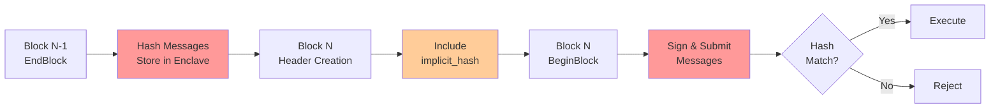

# SecretNetwork Cron Module

## Overview

### Abstract

This document specifies the Cron module for the SecretNetwork.

The Cron module implements a mechanism to add cron schedules through governance proposals to execute arbitrary CosmWasm messages with a given period. This implementation extends Neutron's cron functionality with SecretNetwork's privacy-preserving architecture through a novel **implicit hash consensus mechanism**.

### Concepts

#### High level Mechanism

- add schedule using governance proposals [Permissioned - Main DAO];
- remove schedule using governance proposals [Permissioned - Main DAO or Security subDAO];
- every given block period execute cosmwasm msgs for added schedules.

#### General Mechanics

The module allows to receive `MsgAddSchedule` and `MsgRemoveSchedule` governance messages.

It also contains permissions:
- `MsgAddSchedule` can only be executed as main dao governance proposal
- `MsgRemoveSchedule` can only be executed as main dao governance proposal OR security subdao proposal

In BeginBlocker and EndBlocker module searches for all schedules (with limit by `Params.Limit`) that are ready to be executed, using `last_execute_height`.

That way after the schedule was added it will be executed every `period` of blocks (or more than `period` if too many schedules ready to execute).

#### Example

**Adding schedule**

To add schedule we need to send governance proposal:

```json
{
  "messages": [
    {
      "@type": "/secret.cron.MsgAddSchedule",
      "authority": "secret10d07y265gmmuvt4z0w9aw880jnsr700jc88vt0",
      "name": "custom",
      "period": "2",
      "msgs": [
        {
          "contract": "secret1mfk7n6mc2cg6lznujmeckdh4x0a5ezf6hx6y8q",
          "msg": "7fc422718d9ba824726425866666f408aa66c0d4413803dc064e4ec115bbbbf7{\"increment\":{}}"
        }
      ]
    }
  ],
  "metadata": "ipfs://CID",
  "deposit": "10000000000uscrt",
  "title": "increase counter",
  "summary": "increase counter",
  "expedited": false
}
```

**Removing schedule**

To remove schedule we need to send governance proposal:

```json
{
  "messages": [
    {
      "@type": "/secret.cron.MsgRemoveSchedule",
      "authority": "secret10d07y265gmmuvt4z0w9aw880jnsr700jc88vt0",
      "name": "custom"
    }
  ],
  "metadata": "ipfs://CID",
  "deposit": "10000000000uscrt",
  "title": "remove schedule",
  "summary": "summary",
  "expedited": false
}
```

#### Key Innovation: Implicit Hash Consensus

The core breakthrough is the addition of an `implicit_hash` field to Tendermint block headers, enabling **deterministic consensus on scheduled execution**.

**Header Extension**: Tendermint block headers now include `implicit_hash` - a SHA-256 hash of scheduled messages for the next round.

**Two-Phase Execution**:
1. **Commitment Phase (Block N-1 EndBlock)**: Calculate hash of scheduled messages → store in `tm-secret-enclave`
2. **Execution Phase (Block N BeginBlock)**: Retrieve hash → include in header → verify and execute

#### Architecture

The implementation requires coordinated changes across five repositories:

| Repository | Role | Key Changes |
|------------|------|-------------|
| **SecretNetwork** | Application Logic | Cron scheduling, message encryption, hash calculation |
| **tm-secret-enclave** | Secure State Bridge | Cross-block hash storage |
| **tendermint-go** | Consensus Integration | Header creation with implicit hash |
| **cosmos-sdk** | ABCI Coordination | Header propagation across ABCI methods |
| **tendermint-rs** | Rust Validation | Header structure validation |

#### Execution Flow



#### Message Types

The formats are as follows:

**MsgAddSchedule** - adds new schedule to the cron module:
```protobuf
message MsgAddSchedule {
  string authority = 1;                    // Governance account address
  string name = 2;                         // Schedule identifier
  uint64 period = 3;                       // Execution interval in blocks
  repeated MsgExecuteContract msgs = 4;    // Messages to execute
}
```

**MsgRemoveSchedule** - removes schedule from the cron module:
```protobuf
message MsgRemoveSchedule {
  string authority = 1;                    // Governance account address
  string name = 2;                         // Schedule identifier to remove
}
```

**MsgExecuteContract** - contract execution specification:
```protobuf
message MsgExecuteContract {
  string contract = 1;                     // Smart contract address
  string msg = 2;                          // JSON-encoded message
}
```

After collecting all schedules ready for execution, we execute them in order.

For each schedule, every stored msg is complemented with more necessary fields to form `wasmtypes.MsgExecuteContract`:

```go
// wasmtypes.MsgExecuteContract
msg := types.MsgExecuteContract{
    Sender:    senderAddr,        // Cron module account
    Contract:  contractAddr,      // Passed with Schedule.Msgs
    Msg:       encryptedMsg,      // Encrypted message content
    SentFunds: sdk.NewCoins(),    // Empty Coins
}
```

Then it's executed using wasmd WasmMsgServer implementation within the secure enclave.

For state to be modified, all messages in a given schedule should return successful result. If any cosmwasm msg fails to execute for any reason, all messages in a given schedule will be rolled back.

## Client

### CLI

A user can query and interact with the `cron` module using the CLI.

#### Query

The `query` commands allow users to query `cron` state.

```bash
secretd query cron --help
```

##### params

The `params` command allows users to query module parameters.

```bash
secretd query cron params [flags]
```

Example:
```bash
secretd query cron params
```

Example Output:
```yaml
params:
  limit: 10
  security_address: secret10d07y265gmmuvt4z0w9aw880jnsr700jc88vt0
```

## State

The `cron` module keeps state of the following primary objects:

1. Params
2. Schedules
3. Schedule execution tracking

### Params

Params is a module-wide configuration structure that stores system parameters and defines overall functioning of the cron module.

- Params: `0x01 | ProtocolBuffer(Params)`

```protobuf
message Params {
  string security_address = 1;  // Emergency removal authority
  uint64 limit = 2;             // Max schedules executed per block
}
```

### Schedule

Schedule defines the scheduled execution configuration.

- Schedule: `0x02 | []byte(name) | ProtocolBuffer(Schedule)`

```protobuf
message Schedule {
  string name = 1;                         // Schedule identifier
  uint64 period = 2;                       // Execution interval in blocks
  repeated MsgExecuteContract msgs = 3;    // Messages to execute
  uint64 last_execute_height = 4;          // Last execution block height
}
```

### ScheduleCount

ScheduleCount tracks the total number of schedules for governance limits.

- ScheduleCount: `0x03 | ProtocolBuffer(ScheduleCount)`

```protobuf
message ScheduleCount {
  int32 count = 1;  // The number of current schedules
}
```

### ExecutionStage

ExecutionStage controls the height offset used in schedule readiness checking:

```protobuf
enum ExecutionStage {
  EXECUTION_STAGE_END_BLOCKER = 0;   // Check schedules ready for next block (height + 1)
  EXECUTION_STAGE_BEGIN_BLOCKER = 1; // Check schedules ready for current block (height + 0)
}
```

**Height Offset Logic in `intervalPassed` function**:
```go
func (k *Keeper) intervalPassed(ctx sdk.Context, schedule types.Schedule, executionStage types.ExecutionStage) bool {
    delta := 0
    if executionStage == types.ExecutionStage_EXECUTION_STAGE_END_BLOCKER {
        delta = 1  // Add 1 to current height for next block readiness check
    }
    return uint64(ctx.BlockHeight())+uint64(delta) > (schedule.LastExecuteHeight + schedule.Period)
}
```

**Usage in Message Retrieval**:
- **EXECUTION_STAGE_END_BLOCKER**: Checks if schedules will be ready in the next block (for hash calculation)
- **EXECUTION_STAGE_BEGIN_BLOCKER**: Checks if schedules are ready in the current block (for immediate execution)

### Cross-Block State (tm-secret-enclave)

The cron module also maintains state across block boundaries using the `tm-secret-enclave` component:

#### Implicit Hash Storage

```rust
// Global hash storage with thread safety
static IMPLICIT_HASH: Mutex<[u8; 32]> = Mutex::new(DEFAULT_IMPLICIT_HASH);
```

This storage maintains the SHA-256 hash of scheduled messages between blocks:
- **Block N-1**: Hash calculated and stored during EndBlock
- **Block N**: Hash retrieved and included in block header
- **Verification**: Hash verified during message execution in enclave

## Metrics

The cron module exposes several metrics for monitoring and observability:

### Execution Metrics

#### cron_schedules_executed_total
- **Type**: Counter
- **Description**: Total number of cron schedules executed
- **Labels**: 
  - `execution_stage` (begin_blocker, end_blocker)
  - `status` (success, failure)

#### cron_messages_executed_total
- **Type**: Counter  
- **Description**: Total number of cron messages executed
- **Labels**:
  - `execution_stage` (begin_blocker, end_blocker)
  - `status` (success, failure)
  - `contract_address`

#### cron_execution_duration_seconds
- **Type**: Histogram
- **Description**: Duration of cron schedule execution in seconds
- **Labels**:
  - `execution_stage` (begin_blocker, end_blocker)
  - `schedule_name`
