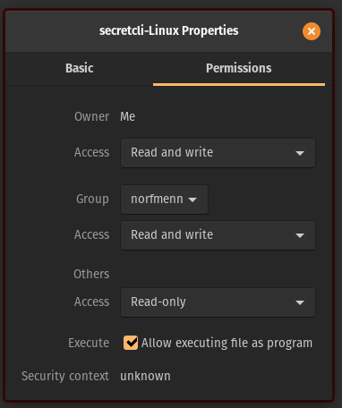

# Install

To install the _secretcli_ [download the latest version here. ](https://github.com/scrtlabs/SecretNetwork/releases)Download the appropriate version of the _secretcli_ based on the operating system you are using:

* secretcli-Linux
* secretcli-macOS
* secretcli-MacOS-arm64
* secretcli-Windows

### Linux

After downloading secretcli-Linux you will need to navigate to the folder you have download it to make secretcli-Linux an executable program using a graphical user interface (GUI) or the command-line.

**Note:** Installing secretcli-Linux will ONLY give you access to the `secretcli` commands. For `secretcli` and `secretd` commands install one of the .deb packages.

#### GUI

Right click on the secretcli-Linux file and select 'Properties', then select 'Permissions', and then check the 'Allow executing the file as program' box beside the 'Execute' column.



#### Command-line

To make secretcli-Linux executable using the command-line navigate to where the file is located and use the following command:

```
chmod +x secretcli-Linux
```

#### Next Steps

You can now use the `secretcli` by using the following command inside of the folder it is located in with:

```
./secretcli-Linux
```

You will see some outputs related to available commands, flags, and usage.

It is recommended to rename seretcli-Linux to 'secretcli', and move the executable file into the correct location so it is automatically executable by typing `secretcli` anywhere within the command-line.

To achieve this use the following commands in the directory containing secretcli-Linux:

```
sudo mv secretcli-Linux /usr/local/bin/secretcli
```

**Congrats! The `secretcli` is now installed!**

### Mac

Download the correct version of the `secretcli` for the Mac hardware on your system [here](https://github.com/scrtlabs/SecretNetwork/releases). After downloading the `secretcli` there are two steps required to allow your system to execute the cli.

First, open your terminal application and navigate to the directory containing the `secretcli` file for your systems hardware. Once in the correct directory you will need to rename the file, and make the file executable using the following commands:

```bash
# for intel mac users use the command below 
mv secretcli-macOS secretcli

# for arm64 mac users use the command below 
mv secretcli-MacOS-arm64 secretcli

# Now make the file executable
chmod 755 secretcli
```

Mac users are required to perform another step after making the `secretcli` executable on their machines. This is because MacOs cannot recognize the developer of the secretcli file. Try running the following command in the directory containing the executable `secretcli`:

```bash
./secretcli
```

You will get a warning popup window with text similar to the following --> **“secretcli” cannot be opened because the developer cannot be verified.** There will be two options: move to trash or cancel. Select cancel.

In order to get your MaOs system to be able to execute the `secretcli`, you will need to change the system preferences on your mac by going to the Apple menu > System Preferences > click Security & Privacy  > then click General.

You will see the text: "secretcli" was blocked from use because it is not from an identified developer. Click the 'Allow Anyway' button.

Now you should be able to use the `secretcli` when inside of the folder it is found in:

```
./secretcli 
```

You will see the following warning popup, click 'open'.


**After clicking open you should see the following output in your terminal application:**

```
The Secret Network App Daemon (server)

Usage:
  secretd [command]

Available Commands:
  add-genesis-account Add a genesis account to genesis.json
  auto-register       Perform remote attestation of the enclave
  check-enclave       Test enclave status
  collect-gentxs      Collect genesis txs and output a genesis.json file
  config              Create or query an application CLI configuration file
  configure-secret    After registration is successful, configure the secret node with the credentials file and the encrypted seed that was written on-chain
  debug               Tool for helping with debugging your application
  export              Export state to JSON
  gentx               Generate a genesis tx carrying a self delegation
  help                Help about any command
  init                Initialize private validator, p2p, genesis, and application configuration files
  init-bootstrap      Perform bootstrap initialization
  init-enclave        Perform remote attestation of the enclave
  keys                Manage your application's keys
  migrate             Migrate genesis to a specified target version
  parse               Verify and parse a certificate file
  query               Querying subcommands
  reset-enclave       Reset registration & enclave parameters
  rollback            rollback cosmos-sdk and tendermint state by one height
  rosetta             spin up a rosetta server
  start               Run the full node
  status              Query remote node for status
  tendermint          Tendermint subcommands
  tx                  Transactions subcommands
  validate-genesis    validates the genesis file at the default location or at the location passed as an arg
  version             Print the application binary version information

Flags:
      --bootstrap           Start the node as the bootstrap node for the network (only used when starting a new network)
  -h, --help                help for secretd
      --home string         directory for config and data (default "/Users/dawsonsewell/.secretd")
      --log_format string   The logging format (json|plain) (default "plain")
      --log_level string    The logging level (trace|debug|info|warn|error|fatal|panic) (default "info")
      --trace               print out full stack trace on errors

Use "secretd [command] --help" for more information about a command.
```

We recommend moving the `secretcli` into your path to be able to use it anywhere within your systems terminal application with:

```
mv secretcli /usr/local/bin
```

**Congrats! The `secretcli` is now installed!**

### Windows (WSL)

`secretcli-Linux` is compatible for use within the Windows Subsystem for Linux (WSL). Follow the Linux Command-line instructions to install it.

### Windows (Native)

After downloading secretcli-Windows you can now use the `secretcli` by using the following command inside of the folder it is located in:

```
./secretcli-Windows
```

You will see some outputs related to available commands, flags, and usage.

It is recommended to rename seretcli-Windows to 'secretcli.exe', and move the executable file to a location where it is automatically executable by typing `secretcli` anywhere within the command-line.

To achieve this use the following commands in a Powershell terminal, in the directory containing secretcli-Windows:

```powershell
mkdir "$home\appdata\local\secretcli"
mv secretcli-Windows "$home/appdata/local/secretcli/secretcli.exe"
$old_path = [Environment]::GetEnvironmentVariable('path', 'user');
$new_path = $old_path + ';' + "$home\appdata\local\secretcli"
[Environment]::SetEnvironmentVariable('path', $new_path,'User');
```

Restart your terminal and test the installation by running:

```powershell
secretcli
```

#### Update SecretCLI (Windows)

To update or install a different version of SecretCLI on Windows, download the release of secretcli-Windows and move it to the correct location:

```powershell
mv secretcli-Windows "$home/appdata/local/secretcli/secretcli.exe"
```

The other commands do not need to be run again if they have already been run on your account.
