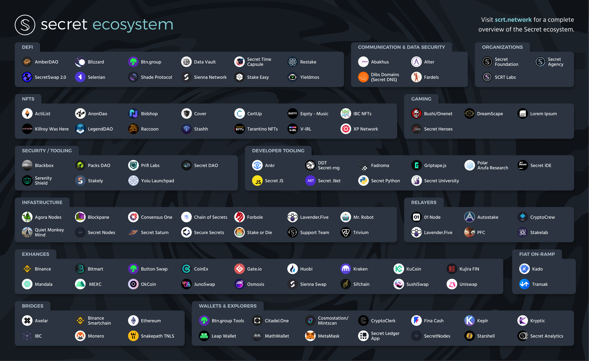

# Ecosystem Overview

This is a list of [Secret Network](https://scrt.network) related projects, tools, games, and more!

The ecosystem is always evolving so feel free to suggest changes as discussions, issues, or PRs if something is missing or incomplete through our[ Github page.](https://github.com/SecretFoundation/docs)

* [General Resources](./#general-resources)
* [Products](./#products)
* [Games](./#games)
* [Explorers](./#explorers)
* [Wallets](./#wallets)
* [User Guides](./#user-guides)
* [Developer Guides](./#developer-guides)
* [Developer Tools](./#developer-tools)
* [Reference Contracts](./#reference-contracts)

<figure><figcaption></figcaption></figure>

## General Resources

### Information resources

* [Main Website](https://scrt.network/) - Official Secret Network website
* [Blog](https://scrt.network/blog/) - Official Secret Network blog
* [Wiki](https://docs.scrt.network/) - Official Secret Network Wiki
* [Secret Network Graypaper ](https://scrt.network/graypaper)- By Carter Woetzel
* [Medium](https://medium.com/@secretnetwork) - Official host for guides and tutorials
* [Youtube ](https://www.youtube.com/c/SecretNetworkOfficial)- Official video platform for Secret Network

### Community Channels

* [Forum](https://forum.scrt.network/)
* [Discord](https://chat.scrt.network)
* [Telegram](https://t.me/scrtCommunity)
* [Reddit](https://www.reddit.com/r/SecretNetwork/)
* [Twitter](https://twitter.com/SecretNetwork)

### Community resources

* [Community Calendar](https://www.secretcalendar.org/) - A calendar of upcoming events, meetings and launches on the network
* [The Secret Agency - ](https://scrt.network/agents)Become a Secret Agent and start participating

## User Guides

### Text Tutorials

* [Secret Network Medium](https://medium.com/@secretnetwork)
  * Guides for products in the ecosystem,
* [Secure Secrets Tutorials](https://securesecrets-org.medium.com/secure-secrets-tutorials-meta-thread-df51b84fa35)
  * Guides on using products in the ecosystem by validator [Secure Secrets](https://www.securesecrets.org)
* [Secret Network Learn environment](https://scrt.network/learn)
  * guides and features for everything Secret Network
  * [Infographic library](https://forum.scrt.network/t/education-infographic-library/5837)
* More tutorials available on the Secret Network [Blog](https://scrt.network/blog/)

### Video Tutorials

* [Official Secret Network Youtube](https://www.youtube.com/c/SecretNetworkOfficial)
  * Run by the Secret Foundation
* [Whisper Node Youtube](https://www.youtube.com/channel/UChAbgpsMHT3ooZfWmjjUtKg/videos)
  * By validator [Whisper Node](https://www.whispernode.com/)
* [Secure Secrets Youtube](https://www.youtube.com/c/SecureSecrets/videos)
  * By validator [Secure Secrets](https://www.securesecrets.org)
* [Travis Bonfigli Youtube](https://www.youtube.com/playlist?list=PL6Tc4k6dl9kK4gmFDdMXVwTiXuS-COgV8)
  * Has a series on Secret Network
* [Secret Code Podcast YouTube - Tutorial Playlist](https://www.youtube.com/watch?v=C0zRTaV8XgI\&list=PLxrw7YCKLEXvPNUJ1SFoHQUUQa4\_Uwwdg)
  * By validator [Secret Code Podcast Node](http://secretcodepodcast.com)
* [Rebel Defi](https://www.youtube.com/c/RebelDefi)
  * Videos on Defi and NFTs in the Cosmos ecosystem
* [Wise beyond bitcoin](https://www.youtube.com/c/wisebeyondbitcoin)
  * Videos on DeFi and Privacy for Secret Network and Crypto in general

### Podcasts

* [Sharing Secrets](https://www.youtube.com/watch?v=-l-c25mhE1M\&list=PLL1JDiTNCUAVq9YeGbxDtqBgaqUZajGIH)
  * Hosted by [Tor Bair](https://twitter.com/TorBair/)
* [Secret Code](https://www.secretcodepodcast.com/)
  * Hosted by [Eric Waisanen](https://twitter.com/EricWaisanen) and [Paul Menexas](https://twitter.com/SecretKnight) ([Twitter](https://twitter.com/secretcodepod))
* [Agents of the Round Table](https://linktr.ee/scrt\_aotrt)
  * Hosted by the [Secret agent community](https://twitter.com/Secret\_AOTRT) and the [Secret Agency](https://mobile.twitter.com/SCRT\_Agency)
* [House of Shade](https://www.youtube.com/channel/UCCK9tPCUf7HNFgg7P1lJd3Q)
  * Hosted by the [House of shade team](https://twitter.com/House\_of\_Shade)

## Developer Guides

Guides about building on the Secret Network

* [Official Guides](https://docs.scrt.network/dev/developers.html)
  * Official Guides written by the community
    * [Quickstart](https://docs.scrt.network/dev/quickstart.html)
      * Set up your environment and start writing contracts as fast as possible
    * [Tutorials](https://docs.scrt.network/dev/tutorials.html)
      * More specific tutorials for different use cases
* [Figment Learn](https://learn.figment.io/protocols/secret)
  * Guides and Tutorials by [Figment](https://figment.io/)
* [Creating my first secret contract](https://darwinzero.medium.com/creating-my-first-secret-contract-on-secret-network-scrt-db0d04597051)
  * Tutorial by DarwinZero
* [Developing your first secret contract](https://github.com/darwinzer0/secret-contract-tutorials/tree/main/tutorial1)
  * Tutorial by DarwinZero
* [How to build a Keplr Staking Web App](https://securesecrets-org.medium.com/secret-network-developer-tutorial-how-to-build-a-keplr-staking-app-49dfeb25abe4)
  * Tutorial by validator [Secure Secrets](https://www.securesecrets.org)
* [Band oracle integration docs](https://hackmd.io/@tansawit/secret-network-developer-doc)
  * By [Band Protocol](https://bandprotocol.com/) ([Announcement](https://scrt.network/blog/band-protocol-live-on-mainnet))

## Developer Tools

Tools for interacting with the secret network and for writing Secret Contracts

* [Local Node](https://hub.docker.com/r/enigmampc/secret-network-sw-dev)
  * Start a docker container with a standalone network
* [Secret IDE](https://github.com/digiline-io/Secret-IDE-Plugin)
  * IDE to make contract development easier
* [Secret DataHub](https://figment.io/datahub/secret-network/) by [Figment](https://figment.io/)
  * Quickly set up a Secret Node on mainnet or testnet for your application
* [Secret API](https://secretapi.io/)
  * Web API for using Secret Network by [Chain of Secrets](https://chainofsecrets.org/)
* [Secret Py](https://pypi.org/project/secret-sdk/)
  * Python library for interacting with the network
* [Secret.js](https://github.com/scrtlabs/secret.js)
  * JavaScript library for interacting with the network ([examples](https://github.com/scrtlabs/SecretJS-Templates))
* [Griptape.js](https://griptapejs.com/) -
  * By Validator [Stake or Die](https://stakeordie.com/), a front-end web framework for developing Dapps on the network
* [Polar](https://www.npmjs.com/package/secret-polar) -
  * A framework for building secret contracts. It features facilitates for [project templates](https://github.com/arufa-research/polar-templates), compilation, deployment, javascript interaction (based on schemas), and testing ([Docs](https://docs.arufaresearch.com/), [Codebase](https://github.com/arufa-research/polar))
* [Secret Toolkit](https://github.com/enigmampc/secret-toolkit)
  * Extra tools for use in Secret Contracts
* [Smart Contract Interface](https://www.btn.group/secret\_network/smart\_contract\_interface)
  * Browser interface for smart contracts by [btn.group](https://www.btn.group)
* [Fadroma](https://github.com/hackbg/fadroma)
  * Industrial strength components and workflows for smart contract development in Rust by [hack.bg](https://hack.bg/)
* [Panic](https://github.com/mohammedpatla/panic\_cosmos)
  * Monitor a validator on the Secret Network with an active telegram bot, email or phone call through Twilio
* [Secret Contract code verifier](https://github.com/digiline-io/secret-contract-verifier)
  * Tool to verify the WASM public binary of any contract against its source code. Make sure live contracts do what the Git repo says they do.
* [Token vesting contract](https://github.com/digiline-io/secret-token-vesting)

## Reference Contracts

Examples of reference Secret Contract implementations

* [Secret Template](https://github.com/enigmampc/secret-template)
  * Quickstart template to start developing Secret Contracts
* [SNIP-20](https://github.com/enigmampc/snip20-reference-impl)
  * Reference SNIP-20 contract implementation (Secret Tokens)
* [SNIP-721](https://github.com/baedrik/snip721-reference-impl)
  * Reference SNIP-721 contract implementation (Secret NFTs)
* [Randomized NFT Minting](https://github.com/luminaryphi/secret-random-minting-snip721-impl)
  * Template for launching NFT projects that need randomized minting
* [Secret Dice](https://github.com/enigmampc/SecretDice)
  * Example of on-chain randomness based on encrypted inputs and state + video tutorial
