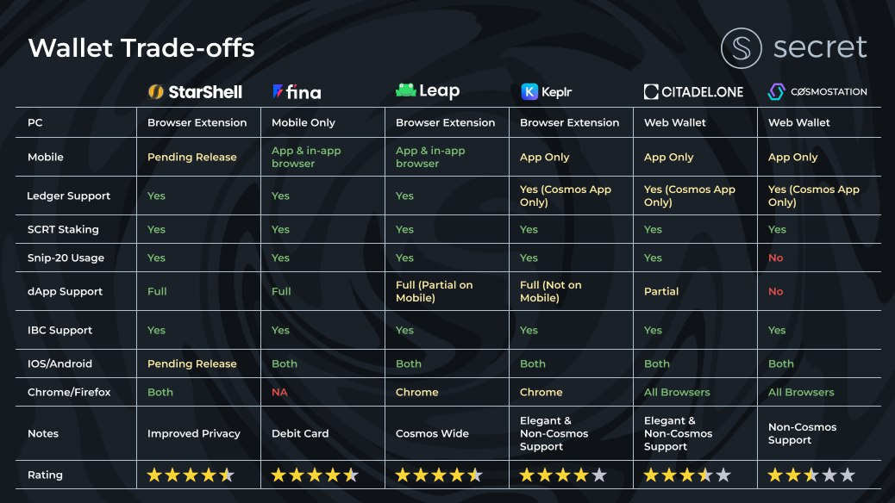

# Wallets

<figure><figcaption></figcaption></figure>

* [Keplr](https://keplr.app) by [Chainapsis](https://chainapsis.com/)
  * Highly featured wallet for the entire Cosmos ecosystem
  * First wallet with full support of SNIP-20 Secret Tokens
  * **Support for usage from any Secret dApp**
  * Convert between SCRT and sSCRT ([in web app](https://wallet.keplr.app/#/secret/secret-secret))
  * Web app + Browser extension + Mobile wallet
* [Ledger](../../development/tools-and-libraries/secret-cli/ledger.md)
  * Guide to using Ledger hardware wallet with Secret Network
* [Cosmostation](https://www.cosmostation.io/)
  * Mobile wallet with support for SCRT
* [Citadel One](https://citadel.one)
  * Great UI and assortment of supported networks
  * Second wallet with full support of SNIP-20 Secret Tokens
  * Built-in support for sending assets across the Ethereum Bridge
  * Convert between SCRT and sSCRT
  * Validator on the network
  * Web app + Mobile wallet
* &#x20;[STARSHELL](https://starshell.net/)
  * Desktop and mobile wallet with SCRT and Secret contract support
  * A privacy-preserving, free and open-source Web3 wallet built for the Secret Network and Cosmos ecosystem.
* Leap wallet
  * Cosmos wide supported wallet
* [Sputnik Exchange](https://sputnik.exchange/) ([Guide](https://www.youtube.com/watch?v=NwiI6xXkMcw))
  * Send SCRT to other Twitter users with a tweet
  * Send SCRT to other Telegram users with a command
  * Buy and sell SCRT from/to other users of Sputnik
* [Fina](https://fina.cash/)
  * First mobile wallet with Secret dApp integration
  * Available on Android and iOS
