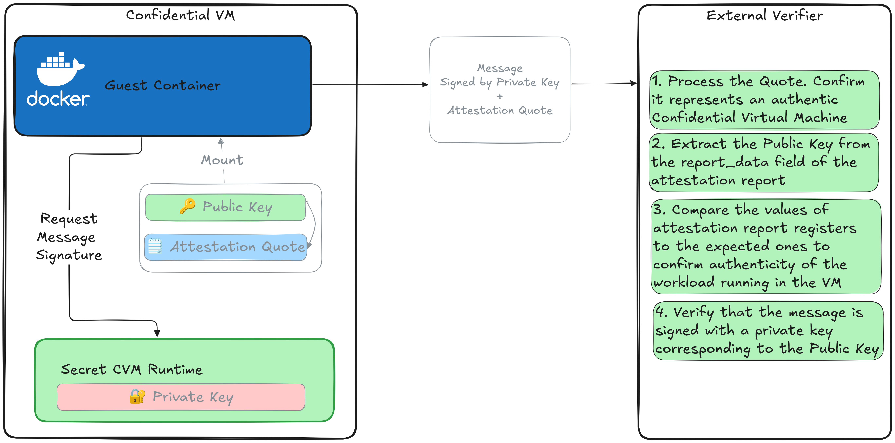

# 🔐 Verifiable Message Signing

## Overview

In certain cases, it may be beneficial for a SecretVM workload to be able to securely sign its messages, proving that they are coming from a genuine TEE running with a verifiable workload.

In order to enable such secure and verifiable signing, SecretVM generates a key pair and a special Attestation Quote tied to the public key.&#x20;

## Key Pairs and Attestation Quote

When a new SecretVM is created, it generates fresh key pairs for all the supported algorithms (see [Supported algorithms](verifiable-message-signing.md#supported-algorithms)). Each newly generated public key is then embedded in a dedicated remote attestation quote, with a separate quote generated for each algorithm-key pair.

The private and public keys, as well as the attestation quote, can be mounted into the Docker container, and the application can use the private key for signing operations with the assurance that the key has never been exposed outside the TEE. The public key and the attestation quote can be presented to external parties to prove that the signing key is held within a secure and trusted environment, and that the environment is running a specific workload. See [Verifying a SecretVM](verifying-a-secretvm/) for more detials.

The following schematic illustrates the process:

<figure><figcaption></figcaption></figure>

## Key benefits

* **Hardware-level Key Protection**: The private key is generated and resides entirely within the TEE, protecting it from compromise even if the host operating system is malicious.
* **Verifiable Trust**: The remote attestation quote provides undeniable proof to third parties that the public key and its corresponding private key were created in a genuine TEE.
* **Simplified Workflow**: The key generation and attestation process is seamlessly integrated into the VM and Docker Compose workflow, requiring minimal configuration.
* **Choice of Cryptography**: Support for both `secp256k1` and `ed25519` allows you to choose the cryptographic algorithm that best suits your application's needs.

## How to use

To enable this feature, you need to add specific volume mounts to your `docker-compose.yaml` file for the service that will use the generated keys. The system will detect these volume mounts and trigger the key generation and attestation process.&#x20;

\
Note:  key generation algorithm is specified directly in the name. For example, if you want to use secp256k1 keys, you should mount `docker_public_key_secp256k1.pem` .

```yaml
services:
  my-secure-app:
    # ... your other service configurations
    volumes:
      - ./crypto/docker_public_key_ed25519.pem:/app/data/pubkey.pem
      - ./crypto/docker_attestation_ed25519.txt:/app/data/quote.txt
```

Once the VM and the container are up and running, your application can find the generated files at the paths specified in the `volumes` section.

* **Public Key** (`pubkey.pem`): This key can be shared with other parties who need to verify signatures created by your application.
* **Attestation Quote** (`quote.txt`): This file should be provided to any external service or client that needs to verify the origin and integrity of your public key. The verifier can then use the TEE vendor's services to validate the quote and establish trust in your signing key.

### SecretVM Signing Server

The SecretVM Signing Server provides a secure way to generate a cryptographic signature for an arbitrary piece of data (a "payload"). This is useful for verifying the integrity and origin of data.

The process involves sending a payload to the server, which then uses a private key stored in a secure environment to sign it. The server returns a unique signature. This signature can then be publicly verified by anyone who has the corresponding public key, confirming that the payload has not been altered and was indeed signed by the holder of the private key.

#### Signing a Payload

**Endpoint**

To generate a signature, you need to send a POST request to the `/sign` endpoint.

* URL: `http://172.17.0.1:49153/sign`
* Method: `POST`
* **Note**: This endpoint is only accessible from within the internal Docker network for security reasons.

**Request Body**

The request body must be a JSON object containing two fields:

* `key_type` (string): The type of cryptographic key to use for signing. In this example, it's `"secp256k1"`.
* `payload` (string): The data that you want to sign.

**Example:**

```bash
curl -X POST 172.17.0.1:49153/sign -d '{"key_type": "secp256k1", "payload": "My Secret Message" }' 
```

**Response**

If the request is successful, the server will return a JSON object containing the base64-encoded signature.

```json
{
  "signature": "MEUCIQD..."
}
```

## Code Sample

```python
import base64
import sys
from typing import Any, Dict

import requests
from cryptography.exceptions import InvalidSignature
from cryptography.hazmat.primitives.asymmetric import ed25519

# --- Configuration ---
CONFIG = {
    "SIGNING_SERVER_URL": "http://127.0.0.1:49153/sign",
    "QUOTE_PARSER_URL": "https://pccs.scrtlabs.com/dcap-tools/quote-parse",
    "REQUEST_TIMEOUT": 5,
    "PLATFORM": "SEV_SNP",
    "EXPECTED_TDX_ATTESTATION": {
        "tcb_svn": "07010300000000000000000000000000",
        "mr_seam": "49b66faa451d19ebbdbe89371b8daf2b65aa3984ec90110343e9e2eec116af08850fa20e3b1aa9a874d77a65380ee7e6",
        "mr_td": "1e305ac8284517f73ada985bfc9fded48b23ed091ba8149678bb10207fb470c7903d7a8ddffa5a7be2a60e349bb75b6e",
        "rtmr0": "9e314df50e8cc934afb28ceb6c96987a04ffea8180037f0d8e12b9690c0d6d34131ecacfd752334d70a40aefce572259",
        "rtmr1": "269ceda0b6ab3d1d290e453c86e746745885bbc276244aa23cc1222b7a9c9570f4f5ba5cd69626f7f2d0acb63cd6656e",
        "rtmr2": "034ef6b547ba74439f307423ec61fc224bacb76018504138b89a3378b5d096434dafbb14dd37700b2823f8b7d6675322",
        "rtmr3": "848a15cc8b2c0bfb1e9e555bb01ed0c2652e6ec219205d6a795e74051e144c7943dcf02bb491df419ed69c8512e0d066",
    },
    "EXPECTED_SEV_SNP_ATTESTATION": {
        "measurement": "b759168428db0a9e4b286443b1ec3055dbfdb31f8a7b58e12218c748d33281c96bb3b83f8f0e7c2ec9cfa5b2dc6cef7e",
    },
}


# --- Custom Exceptions for clear error handling ---
class SigningError(Exception):
    pass


class QuoteParsingError(Exception):
    pass


class VerificationError(Exception):
    pass


def sign_with_server(payload: str) -> str:
    """Requests a signature from a remote server."""
    request_data = {"key_type": "ed25519", "payload": payload}
    try:
        response = requests.post(
            CONFIG["SIGNING_SERVER_URL"],
            json=request_data,
            timeout=CONFIG["REQUEST_TIMEOUT"],
        )
        response.raise_for_status()
        signature = response.json().get("signature")
        if not signature:
            raise SigningError("Signature not found in server response.")
        return signature
    except requests.exceptions.RequestException as e:
        raise SigningError(f"Network error connecting to signing server: {e}") from e
    except ValueError as e:
        raise SigningError(f"Failed to decode server response: {e}") from e


def parse_tdx_quote(quote_b64: str) -> Dict[str, Any]:
    """Parses an Intel TDX/SGX quote using SCRT Labs PCCS service."""
    try:
        response = requests.post(CONFIG["QUOTE_PARSER_URL"], json={"quote": quote_b64})
        response.raise_for_status()
        parsed_quote = response.json().get("quote")
        if not parsed_quote:
            raise QuoteParsingError("Parsed quote not found in service response.")
        return parsed_quote
    except requests.exceptions.RequestException as e:
        raise QuoteParsingError(f"Network error connecting to quote parser: {e}") from e
    except ValueError as e:
        raise QuoteParsingError(f"Failed to decode parser response: {e}") from e


def parse_sev_snp_report(report_b64: str) -> Dict[str, Any]:
    """
    Parses a raw AMD SEV-SNP Attestation Report locally.
    Based on AMD SEV-SNP ABI Specification 3.03.
    """
    try:
        report_bytes = base64.b64decode(report_b64)

        # SEV-SNP Report is typically 1184 bytes
        if len(report_bytes) < 1184:
            raise ValueError(
                f"Report too short: {len(report_bytes)} bytes (expected >= 1184)"
            )

        # Offsets defined in AMD Spec
        # REPORT_DATA: Offset 0x50 (80) -> Length 64
        # MEASUREMENT: Offset 0x90 (144) -> Length 48

        report_data = report_bytes[80:144]
        measurement = report_bytes[144:192]

        return {
            "report_data": report_data.hex(),
            "measurement": measurement.hex(),
        }
    except Exception as e:
        raise QuoteParsingError(f"Failed to parse SEV-SNP report: {e}")


def verify_attestation(parsed_quote: Dict[str, Any], platform: str) -> bool:
    """Validates the parsed quote against the configuration for the specific platform."""
    if platform == "TDX":
        expected = CONFIG["EXPECTED_TDX_ATTESTATION"]
        keys = ["tcb_svn", "mr_seam", "mr_td", "rtmr0", "rtmr1", "rtmr2", "rtmr3"]
        return all(parsed_quote.get(k) == expected[k] for k in keys)

    elif platform == "SEV_SNP":
        expected = CONFIG["EXPECTED_SEV_SNP_ATTESTATION"]
        if parsed_quote.get("measurement") != expected["measurement"]:
            print(
                f"Mismatch: Found {parsed_quote.get('measurement')}, expected {expected['measurement']}"
            )
            return False
        return True

    return False


def verify_signature_with_attestation(
    message: str, signature_b64: str, quote_file_path: str
) -> bool:
    """Verifies a signature against a public key derived from an attested quote."""
    platform = CONFIG["PLATFORM"]
    print(f"Verifying for {platform} platform...")

    try:
        # 1. Read and Parse Quote
        with open(quote_file_path, "r") as f:
            quote = f.read().strip()

        if platform == "TDX":
            parsed_quote = parse_tdx_quote(quote)
        elif platform == "SEV_SNP":
            parsed_quote = parse_sev_snp_report(quote)
        else:
            raise ValueError(f"Unknown attestation type: {platform}")

        # 2. Verify Attestation
        if not verify_attestation(parsed_quote, platform):
            raise VerificationError(
                f"{platform} Attestation mismatch: Parsed quote does not match expected values."
            )
        print("Attestation is VALID.")

        # 3. Extract Public Key & Verify Signature
        report_data_hex = parsed_quote.get("report_data", "")
        if len(report_data_hex) < 64:
            raise VerificationError("Report data is too short to contain a public key.")

        public_key_bytes = bytes.fromhex(report_data_hex[:64])
        public_key = ed25519.Ed25519PublicKey.from_public_bytes(public_key_bytes)

        signature_bytes = base64.b64decode(signature_b64)
        public_key.verify(signature_bytes, message.encode("utf-8"))

        print("Signature is VALID.")
        return True

    except FileNotFoundError:
        print(f"Quote file not found at: {quote_file_path}")
        return False
    except (
        InvalidSignature,
        VerificationError,
        QuoteParsingError,
        ValueError,
        TypeError,
    ) as e:
        print(f"Verification FAILED: {e}")
        return False
    except Exception:
        print("An unexpected error occurred during verification.")
        return False


def main():
    """Main execution function to demonstrate the workflow."""
    message = "My Secret Message"
    quote_file = "docker_attestation_ed25519.txt"
    try:
        signature = sign_with_server(message)
        print(f"Received signature: {signature[:30]}...")

        is_valid = verify_signature_with_attestation(message, signature, quote_file)
        print(
            f"\n--- Verification Result: {'Successful' if is_valid else 'Failed'} ---"
        )

    except SigningError as e:
        print(f"Could not obtain signature: {e}")
        sys.exit(1)


if __name__ == "__main__":
    main()

```

## Supported algorithms

* secp256k1 (default)
* ed25519
